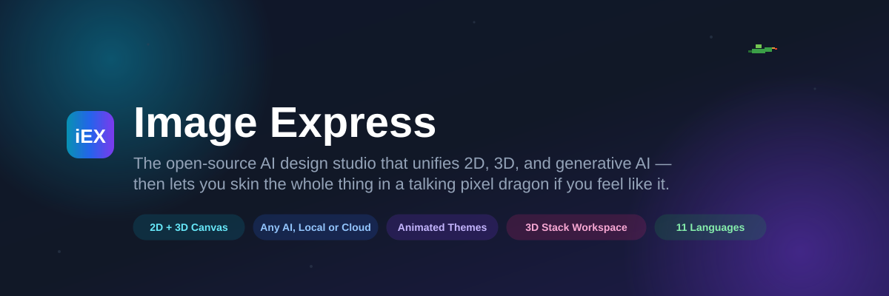
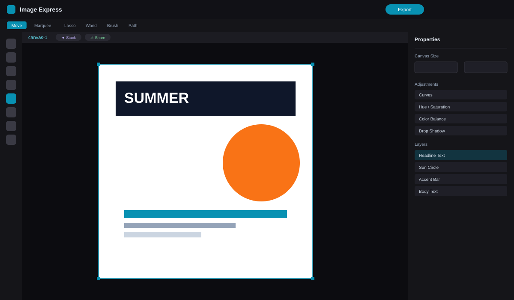
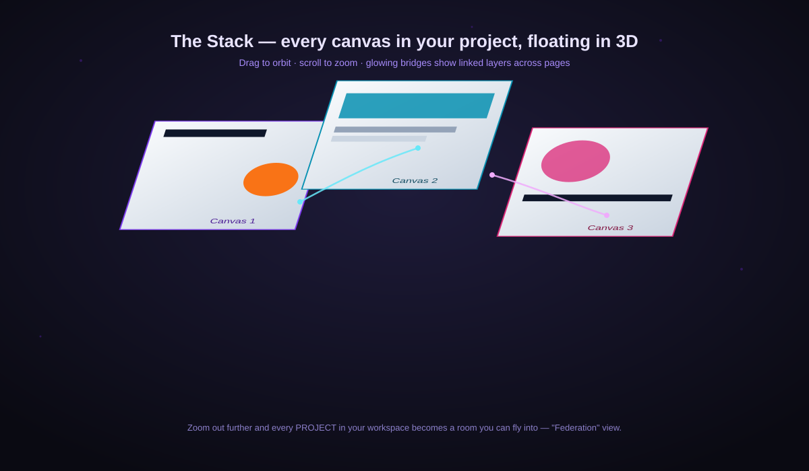
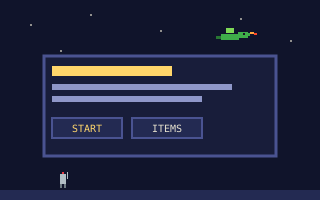
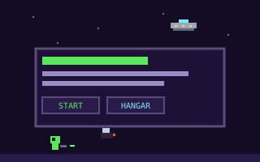
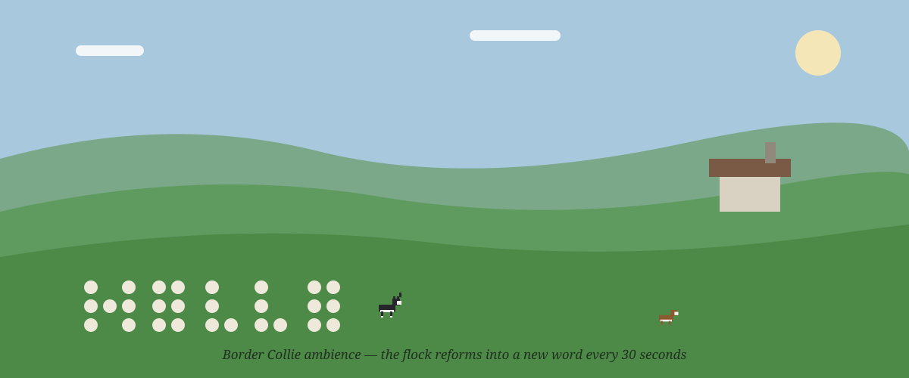
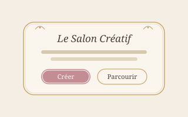
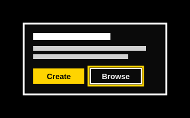
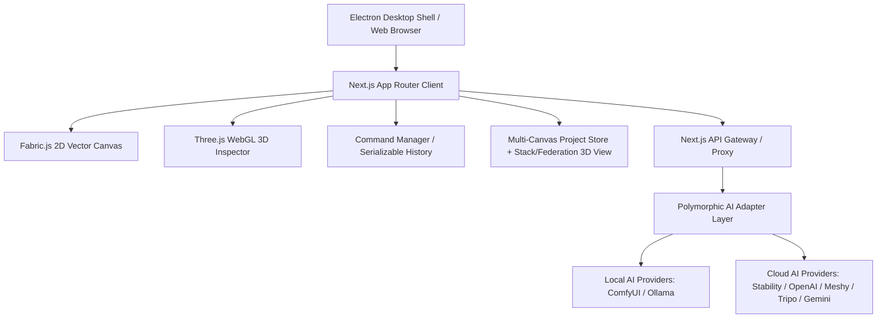

<div align="center">



# Image Express

**The free, open-source design studio that fuses a professional 2D canvas, live 3D generation, and any AI provider — local or cloud — into one workspace. Skin the whole thing with downloadable animated theme packs.**

[](#-license)
[](https://nextjs.org/)
[](https://www.typescriptlang.org/)
[](#-install--run)
[](#-11-languages-out-of-the-box)

**[Quick Install](#-install--run)** ·
**[Features](#-why-image-express)** ·
**[Screenshots](#-see-it-in-action)** ·
**[Themes](#-make-it-yours-animated-theme-packs)** ·
**[Support the Project](#-support-the-project)**

</div>

---

## What is Image Express?

Most design tools make you juggle three separate apps: a vector/raster editor for layout, a 3D viewer for product shots and models, and a web console for AI generation. **Image Express is all three in one.** Design a poster, generate a 3D model from text, pose it, bake a flat render straight onto your canvas, retouch it with a real healing brush, run it past a local AI critique, and export — without ever leaving the tab.

It runs anywhere: as a **desktop app** on Windows/macOS, as a **self-hosted web app** in Docker, or straight from **npm** on your own machine. Every AI feature works with **your own keys** (Stability, OpenAI, Gemini, Meshy, Tripo, Hitem3D) or **entirely offline** with local ComfyUI and Ollama — your prompts and images never have to touch our servers, because we don't have any.

---

## 🚀 Install & Run

No native `.exe`/`.dmg` installer is published yet — the installer below is the
real, working path today. It's still just "download one file, double-click
it, answer a couple of questions" — no experience with computers required,
and it installs everything else (Git, Node.js) for you.

### 🪟 Windows — step by step

1. **[Click here to open `install.bat`](https://github.com/GeekatplayStudio/Image-Express/blob/main/install.bat)**, then click the little **⬇ download icon** near the top-right of the code box to save it.
2. Open your **Downloads** folder and **double-click `install.bat`**.
3. If a blue **"Windows protected your PC"** screen appears, click **More info**, then **Run anyway**. *(This only means the file isn't sold through the Microsoft Store — Image Express is free, open-source software, so it doesn't have a paid publisher certificate. It is not a virus warning.)*
4. A black window opens and walks you through everything else. **Press Enter** at each question to accept the suggested answer. It installs Git and Node.js if you don't already have them, then downloads and sets up Image Express — this takes a few minutes.
5. When it finishes, answer **yes** to "Create a desktop shortcut?" and **yes** to "Launch now?" — Image Express opens in your web browser.
6. **Next time**, just double-click the **Image Express** shortcut on your desktop (or `start.bat` inside `C:\Users\<you>\ImageExpress`).

### 🍎 macOS — step by step

The easiest way uses **Terminal** and skips every "unidentified developer"
warning entirely — it's three steps:

1. Open **Terminal**: press <kbd>⌘ Cmd</kbd> + <kbd>Space</kbd>, type `Terminal`, press Return.
2. **Copy** the line below, **paste** it into the Terminal window (right-click → Paste, or <kbd>⌘ Cmd</kbd> + <kbd>V</kbd>), then press Return:
   ```bash
   bash <(curl -fsSL https://raw.githubusercontent.com/GeekatplayStudio/Image-Express/main/install.command)
   ```
3. It asks a few questions — **press Return** at each one to accept the suggested answer. It installs Git and Node.js if needed, then downloads and sets up Image Express (a few minutes). When it asks, answer **yes** to "Launch Image Express now?"
4. **Next time**, open **Finder → your home folder → ImageExpress**, and double-click **`start.command`**.

<details>
<summary><b>Prefer clicking a file instead of using Terminal?</b> (needs one extra step to get past macOS's security warning)</summary>
<br>

Download **[`install.command`](https://github.com/GeekatplayStudio/Image-Express/blob/main/install.command)** (click the **⬇ download icon** on that page). In **Finder**, **right-click** (or Control-click) `install.command` and choose **Open** — don't double-click it the first time. macOS will warn that it can't verify the developer; this is normal for open-source software that isn't sold through the App Store, **not** a sign of malware. Click **Open** to continue.

If macOS still refuses — a stronger warning about malware, or no "Open" button — go to **Apple menu → System Settings → Privacy & Security**, scroll down to the message about `install.command` being blocked, click **Open Anyway**, and confirm with your password or Touch ID. Then go back to Finder and right-click → **Open** once more.

If nothing happens at all when you open it, use the Terminal method above instead — it always works, because it never downloads a blocked file in the first place.
</details>

That's it. You never need to know what Git, Node.js, or npm are — the
installer handles all of that. Every step it takes is logged to a file you
can hand to support if anything goes wrong: `~/ImageExpress-setup.log` (macOS)
or `%USERPROFILE%\ImageExpress-setup.log` (Windows). Full details, Linux, and
manual/advanced setup: **[docs/INSTALLATION.md](docs/INSTALLATION.md)**.

> **Windows install slow (15+ min) or failing with `ENOTEMPTY`/`TAR_ENTRY_ERROR`?**
> That's real-time antivirus scanning fighting npm over thousands of small
> files. One admin-PowerShell command excludes just this project folder and
> makes installs several times faster — see
> [Troubleshooting](docs/INSTALLATION.md#5-troubleshooting).

### 🔄 Keep it updated (source installs)

| Action | Command / file |
|---|---|
| **Run (auto-updates when clean)** | `start.bat` (Windows) · `start.command` (macOS) · `npm run launch` |
| **Update code + deps** | `npm run update` |
| **Check only** | `npm run update -- --check` |
| **Also refresh libraries in-range** | `npm run update -- --libs` |
| **Force main branch + update** | `npm run update -- --main` |

The updater never destroys local edits (dirty tree → refuse) and only fast-forwards. Dependencies are repaired automatically via `scripts/ensure-deps.mjs` (`npm ci` when possible, `npm install` fallback, integrity marker).

Packaged desktop releases use the native GitHub Releases updater instead — the two systems are not mixed.

### 🐳 Self-host it (Docker / your own server)

```bash
docker build -t image-express .
docker run -p 3000:3000 image-express
```

Or classic npm on any server:

```bash
git clone https://github.com/GeekatplayStudio/Image-Express.git
cd Image-Express && npm install
npm run build && npm run start
```

### 🧑‍💻 Developer / npm scripts

```bash
npm run setup            # install/repair dependencies on the right Node + npm
npm run dev              # web dev server → http://localhost:3000
npm run desktop:dev      # Electron desktop shell, hot reload
npm run desktop:build    # package installers (Win NSIS / mac DMG / Linux AppImage)
npm run install:super    # interactive ComfyUI + Ollama installer, models fully opt-in
npm run doctor:node      # is this shell's Node new enough? where's a good one?
npm run verify           # the full gate: audits, lint, types, tests, build, bundle
```

### Node 24+ is required — and the toolchain enforces it for you

A version manager (nvm, nvm4w, volta, fnm) will happily leave an older Node
first on `PATH`, and npm downgrades that mismatch to a warning and installs
anyway — which is how you get a subtly wrong `node_modules`, a rewritten
lockfile, or a build that fails much later with an unrelated error.

So `setup`, `build`, `dev`, `start`, `update` and every `desktop:*` script
re-execute themselves under a supported Node when one exists anywhere on the
machine, and use **that** Node's npm rather than whatever the shell provides.
You do not have to fix your shell first. `npm run doctor:node` reports what is
being used.

Verified end-to-end from a shell serving Node 22.22.0 / npm 10.9.4, with a
supported Node 26.4.0 installed elsewhere and shadowed on `PATH`:

| Command | Exit | Result |
|---|---|---|
| `npm run setup` | 0 | switches to Node 26.4.0 **and npm 11.17.0** — no `EBADENGINE` |
| `npm run build` | 0 | |
| `npm run verify` | 0 | 148 suites, 864 tests |
| `npm run desktop:pack` | 0 | |
| `npm run desktop:verify-package` | 0 | standalone 120 MB, inside the 400 MB budget |
| `npm run desktop:smoke-package` | 0 | packaged app launches: electron-ready → server-ready → window-ready |
| `package-lock.json` after install | — | unchanged |

The one path that cannot self-correct is a bare `npm install`: that is npm's own
process, so nothing in the repo runs before it. Use `npm run setup` instead, or
point your version manager at the pinned release — `nvm install 24.14.1 && nvm
use 24.14.1` (see [`.nvmrc`](.nvmrc)).

Full walkthrough, ComfyUI/Ollama setup, Docker volume mounts, and API-key configuration: **[docs/INSTALLATION.md](docs/INSTALLATION.md)** · desktop packaging internals: **[docs/DESKTOP.md](docs/DESKTOP.md)** · driving the app from AI agents (Claude Desktop/Code) via Model Context Protocol: **[docs/MCP.md](docs/MCP.md)** · canonical terminology (workspace / canvas / page / album / library): **[docs/GLOSSARY.md](docs/GLOSSARY.md)**.

> **Privacy by design**: no telemetry, no bundled models, no bundled art assets — a fresh clone is source code only. Every AI feature is opt-in and uses whichever provider *you* configure, including 100%-local ComfyUI + Ollama with zero cloud calls.

---

## 🖼 See It In Action

<table>
<tr>
<td width="50%">

**The full studio** — infinite 2D canvas, professional layer stack, retouch suite, and a context-aware properties panel with curves, channels, and non-destructive masks.

</td>
<td width="50%">

**The Stack** — every canvas in your project floating as a live plane in true 3D space. Drag to orbit, scroll to zoom, arrow-key between pages. Zoom out further and it becomes **Federation** view — your whole workspace as a flyable map of projects.

</td>
</tr>
<tr>
<td></td>
<td></td>
</tr>
</table>

---

## ⭐ Why Image Express

### One canvas, three disciplines
- **Infinite 2D vector/raster canvas** (Fabric.js) with professional layer management — locking, folders, multi-select, arrange mode, non-destructive clip masks with gradient fades.
- **Switchable tool groups**: right-click Selection, Retouch, or **Fill/Gradient** on the rail to flip between their sub-tools, same as Photoshop's flyouts. Fill/Gradient includes a **New Fill/Gradient Layer** mode that drops a page-filling gradient layer ready to edit.
- **Live 3D layer editor** (Three.js/WebGL) — pose, light, and shadow a generated or uploaded 3D model right inside a canvas layer, with realistic soft shadows (true penumbra, not a blurred pixel grid) that scale correctly with the model instead of clipping at a fixed radius. Your lighting setup carries over to the next new model you open, so you're not re-lighting from scratch every time.
- **⚡ Frame Bake** — our name for capturing the exact 3D pose you like and baking it into a flat, further-editable 2D PNG layer with one click. Design in 3D, finish in 2D, no round-trip to another app.
- **Real retouching brushes**: Spot Healing, Clone Stamp, Dodge, Burn, Sponge, History Brush, Blur/Sharpen — not filter presets, actual brush-based tools.
- **Curved & circular text**, 13 font families, gradient editor, extended shape library, perspective front/back presets.
- **Photoshop-grade shortcuts**: `V/M/L/W/T/U/P/B/J/S/O/G/I/C/H/Z`, `Ctrl/Cmd+S` to save, Space-drag pan, Alt-drag duplicate, full undo/redo history.

### 🧩 Canvas Stacking & Cross-Canvas Sync *(unique to Image Express)*
Most tools give you one canvas per document. Image Express gives every project a whole **deck of canvases** you flip between instantly — and any layer can be marked **Linked**, broadcasting itself into every other canvas (even across different projects). Edit the linked object once — move it, recolor it, adjust it — and every copy across your entire workspace updates in real time. The **Stack View** visualizes these links as glowing bridge-curves between floating 3D planes, so you can literally *see* your project's data flow, node-editor style. Perfect for template families, multi-page campaigns, and brand-kit consistency.

### 🤖 Any AI you want — local or cloud, your keys, your rules
- **3D generation**: Meshy, Tripo, and Hitem3D — full PBR texturing, background job polling.
- **2D generation**: Stability AI, OpenAI (DALL·E 3), Google Gemini, Banana.dev/NanoBanana, and full **ComfyUI** integration (local, Docker, or Comfy Cloud) with a workflow library browser and same-origin proxying.
- **100% local option**: run **Ollama** for local SVG generation and layer/canvas **AI Critique** — nothing ever leaves your machine. The app auto-detects missing local models and offers an inline one-click install.
- **AI Edit Notes (Beta)**: annotate a layer with point notes, save a flattened reference layer with embedded edit instructions, and hand it straight to a ComfyUI/Flux workflow for guided AI editing.
- A **polymorphic AI adapter layer** means every provider returns the same normalized shape to the UI — swap providers mid-project with zero rework.

### 📚 Real asset & project management
- **Asset Library**: drag-and-drop multi-file ingestion (mixed images/video/audio/3D lands in the right tabs automatically), folders, search, personal-vs-shared scope, public/private visibility, and **live rotating 3D previews on hover** plus real rendered thumbnails for 3D models in the grid — not just an icon.
- **Single click opens a large preview** for any asset with an Add-to-Canvas button; **double-click or the hover “+” button** adds it straight to the canvas. Video previews support real scrubbing and a **Capture Frame** button that grabs the current frame as a new image layer.
- **AI-assisted asset search (optional, local)**: new uploads are indexed automatically — dimensions and any embedded generation prompt always, plus an AI caption + tags from a local Ollama vision model when you opt in — so you can find an asset by what's *in* it, not just its filename.
- **Portable Library Bundles**: export your entire asset library (with owner/visibility metadata) as one file and re-import it on another machine or project.
- **Server-side design storage** (no browser-storage limits), optional **Google Drive backup** mirroring every save automatically, and full **export** to PNG/JPG/SVG/PDF/JSON/self-contained offline HTML — plus **machine embroidery (.DST)**, see below.

### 🧵 Machine Embroidery Export — design it, sew it
Export any page straight to **Tajima .DST**, the format nearly every embroidery machine on the planet reads. Pick how many thread colors to reduce your design to, set physical width, fill density, and max stitch length, and optionally skip the background (transparent areas and the color dominating the page border are auto-detected and never stitched). The engine generates real running-stitch fills with tie-in/tie-off locks and proper jump-vs-travel logic — not a naive pixel-to-stitch dump — and the preview window includes **zoom/pan** plus a **stitch-out simulator**: drag a slider (or hit play) to watch the exact needle path draw itself in sewing order, thread by thread, before you commit it to a machine.

### 🌍 11 languages, growing
English, German, Spanish, French, Italian, Japanese, Polish, Portuguese, Russian, Ukrainian, and Chinese are all selectable from the top-bar globe menu, with automatic locale persistence. **English, Russian, and Ukrainian are at 100% UI coverage** today — every panel, from the dashboard to the deepest properties tab. The rest are being brought up to the same bar one functional area at a time (Spanish is next); until then they fall back to English string-by-string, so nothing ever renders blank.

### 🎭 Themes that are actually alive
Keep reading — this is the part that has to be seen to be believed. →

---

## 🎨 Make It Yours: Animated Theme Packs

Interface themes aren't just color swaps here. A theme pack can restyle every panel, button, and font in the app **and** populate your dashboard with small, tasteful sprite animations and living background scenes — built entirely from CSS and PNG sprite sheets (no JavaScript ever ships inside a pack, so installing one is always safe).

Everything below installs in one click from **Settings → Workspace → Interface Themes / Dashboard Ambience**, and nothing is bundled by default — only the classic look plus two accessibility/elegance themes ship with a fresh install. Everything else is a free download away.

<table>
<tr>
<td width="50%"><br/><sub align="center"><b>Pixel RPG</b> — a dragon circles the sky, knights build (and lose) a castle, a full royal parade marches by, and yes, a knight can ride the dragon.</sub></td>
<td width="50%"><br/><sub align="center"><b>Pixel Cosmos</b> — flying saucers patrol the dashboard, land near your cursor, and aliens occasionally blaster-fight a giant space fly.</sub></td>
</tr>
<tr>
<td width="50%"><br/><sub align="center"><b>Border Collie</b> — the flock literally spells words with their bodies, rehearses a sheep choir, holds a rock concert, and yes, there's a jetpack.</sub></td>
<td width="50%"><br/><sub align="center"><b>Rococo</b> — bundled by default. A soft pastel salon: warm cream, muted rose &amp; sage, gilded double-border buttons, serif type. Elegant, never overdone.</sub></td>
</tr>
</table>



**Clarity — High Contrast** ships bundled too: pure black/white AAA-contrast surfaces, thick 3px borders, and unmistakable bold-yellow focus rings, built specifically for low-vision comfort — because accessibility shouldn't be a paid add-on.

Every animated pack comes with its own set of **original jokes and facts** that replace the dashboard's rotating quote ("A dragon's hoard is 90% gold and 10% things it sat on and forgot about."), a frequency slider to dial the animation from *Occasionally* to *Annoying*, and — because we know some of you want the studio to just be a studio — an always-available **default theme with zero animation**.

Building your own pack is straightforward and fully documented in [`docs/THEME_PACKS_SPEC.md`](docs/THEME_PACKS_SPEC.md) — packs are just JSON + CSS + PNG, no build step, no code execution, ever.

---

## 💚 Support the Project

Image Express is free and MIT-friendly open source, full stop — every feature above works without spending a cent. If it's useful to you and you'd like to say thanks, the most fun way is picking up an extra theme pack (dragons, aliens, sci-fi collies, and more retro-OS skins) from the shop below. It's entirely optional, genuinely appreciated, and every purchase goes straight back into building more of this.

<div align="center">

### **[🛍️ Browse more theme packs on Gumroad →](https://geekatplay.gumroad.com/)**

*No purchase is required for any core feature — this is a thank-you tip jar with really good production values.*

</div>

---

## 🛠️ Engineering Case Study

<details>
<summary><b>Click to expand — architecture, key decisions, and hard problems solved (for engineers evaluating the codebase)</b></summary>

### Executive Summary
* **Problem**: Digital design workflows are typically fractured. Designers are forced to toggle between vector editors (e.g., Photoshop, Illustrator) for canvas layouts, separate WebGL environments for 3D staging, and distinct web interfaces (e.g., ComfyUI, Automatic1111) for generative AI tasks.
* **Why Created**: Image Express was built to unify these disparate pipelines into a single, high-performance open-source platform. It bridges interactive 2D canvas layouts, live WebGL 3D inspectors, and multi-provider AI generators (local Ollama/ComfyUI alongside cloud Meshy/Tripo/Stability/OpenAI pathways) under a single UI.
* **Who it is for**: Digital creators, visual designers, and developers looking for a customizable, extensible design suite that exposes professional vector, brush, and AI controls.
* **Technical Interest**: Integrating a stateful 2D canvas (Fabric.js) with real-time 3D environments (Three.js), sandboxed desktop environments (Electron), and distributed, high-latency generative AI routes.

### Engineering Challenge
* **Context Synchronization**: Managing coordinate systems and transformation matrices across independent 2D vector layouts and WebGL 3D scenes. When 3D layers are resized, scaled, or rotated, matrix math must translate user gestures from canvas coordinate space to WebGL clip space in real-time.
* **Hybrid Execution & Network Fallbacks**: Transitioning dynamically between high-throughput cloud endpoints and local instances (ComfyUI, Ollama). The app must support Docker loopbacks (resolving local targets between `localhost` and `host.docker.internal`), handle transient service outages with server-side retries, and manage model downloads/installations inline.
* **Memory & Layout Overhead**: Running high-resolution canvas brush engines (Spot Healing, Dodge, Burn, Clone Stamp), complex non-destructive raster masking, and nested vector folders without triggering browser memory leaks or dropping frame rates in Electron.
* **Cross-Canvas State Propagation**: Once a layer can be "shared" across many canvases and projects simultaneously, every mutation (`object:modified`) has to fan out to every linked instance without creating circular update loops or desyncing transform state.

### Architecture Overview
Image Express uses a modular, decoupled architecture separating canvas layouts, AI adapters, and application runtimes.



* **Canvas Engine**: Standard Fabric.js core extended with custom subclass renderers (e.g., `WarpedImage` for perspective transformations, custom prototype extensions for styled text layout cards).
* **AI Abstraction Layer (`AiRuntimeManager`)**: A polymorphic adapter framework separating the front-end from individual generation APIs. It normalizes inputs and outputs, manages async polling states, and simplifies provider selection.
* **Command Pattern Engine**: Tracks every user canvas interaction (moves, resizing, properties) as discrete, serializable command payloads. This provides a clear audit trail and enables reliable undo/redo capabilities.
* **Multi-Canvas Project Store**: Each project owns an array of canvases plus a shared-layer registry (`sharedLayerId`); a Three.js overlay (`CanvasStackView`) renders every canvas as a floating textured plane and every project as a navigable "room" in Federation mode, with animated bridge curves tracing live shared-layer links.
* **Theme/Ambience Pack Engine**: A sandboxed, code-free pack format (manifest JSON + CSS + PNG sprite sheets) drives both the interface theme system and a small built-in sprite/animation runtime (`SpriteTheater`, `DashboardAmbience`) — packs declare *scenes* from a fixed vocabulary (fly-across, chase, build-and-destroy, word-formation, concert, dance party, ...) that the app itself interprets and renders; no pack can execute arbitrary code.

### Technology Choices
* **Next.js 16 (App Router) & TypeScript**: Provides a robust SSR framework combined with static type safety. TypeScript coordinates complex Fabric interface configurations (`ExtendedFabricObject`) and ensures strict API contracts for polymorphic AI payloads.
* **Fabric.js**: Selected as the 2D layout engine for its out-of-the-box object tree, mouse event handling, vector controls, and serialization/cloning support.
  * *Alternatives Considered*: Native HTML5 Canvas API (rejected due to the excessive overhead of rebuilding selection bounds, multi-select, scaling anchors, and layered object rendering from scratch). Pixi.js (rejected because its WebGL focus makes vector editing, text path alignments, and standard SVG rendering overly complex).
* **Three.js & React Three Fiber**: Used for both the WebGL 3D layer inspector overlay and the Stack/Federation project-navigation view. Provides high-fidelity rendering, lighting controls, shadow maps, and PBR textures within a canvas container.
* **Electron**: Wraps the web application into a sandboxed desktop container. The production server now runs as an independent child process (not `require()`d in-process) so a server crash can never take the window down with it, with a free-port scan on launch and full startup tracing to a log file for support.

### Key Engineering Decisions
* **Polymorphic AI Adapter Pattern**: To prevent API-specific leakage into React views, all generative actions run through `AiRuntimeManager`. This normalizes disparate responses into a unified structure, allowing hot-swapping between cloud engines and local models (e.g., local Ollama for SVG layouts vs. OpenAI or Stability).
* **Prototype-Injected Text Background Rendering**: Instead of writing separate wrapper groups that must manually re-align whenever text is modified, we patched `_render` directly on `fabric.IText` and `fabric.Textbox` prototypes. This intercepts the Fabric draw call, dynamically rendering styled rectangles, capsule pills, or speech bubble frames behind the text glyphs in real-time as the user types.
* **Centralized Command Persistence**: All editor actions are serialized to JSON commands. This makes the workspace history replayable, supports automated offline dry-runs for quality testing, and prepares the codebase for future real-time collaborative syncing.
* **No-Code-In-Packs Guarantee**: Theme and ambience packs are validated server-side (zip-slip protection, extension allow-lists, CSS pattern scanning for `@import`/external URLs, SVG script-tag stripping) before install, and every visual "scene" is drawn by first-party engine code reading declarative JSON — a pack can look like anything but can never run anything.

### Tradeoffs
* **Canvas Overlay vs. Native Grouping for 3D Layers**:
  * *Decision*: Rendered the 3D WebGL runtime in a HTML container positioned directly over the active 2D layer, rather than mapping 3D rendering cycles directly into Fabric's 2D context.
  * *Tradeoff*: Ensures highly performant lighting, environment maps, and rotation animations. However, it requires coordinate synchronization helpers to align the WebGL container position and dimensions with the 2D bounding boxes on canvas zoom or drag.
* **Next.js API Gateway as Proxy Tier**:
  * *Decision*: All AI generation and storage requests pass through local Next.js API endpoints.
  * *Tradeoff*: Prevents client-side CORS failures and keeps private API keys secure. However, it introduces a minor routing latency and memory overhead on the server when transferring heavy high-resolution image assets or 3D files.

### Interesting Technical Problems
* **Photoshop-Style Path Pen Loop Closure**:
  * *Problem*: When using the Pen tool to draw vector layouts, closing the shape by clicking the initial anchor point was unreliable, causing unclosed paths.
  * *Solution*: Implemented a fuzzy-coordinate threshold check (20px radius) and anchor index evaluation (`index === 0`). When triggered, the engine terminates draft drawing, compiles path nodes, sets the `penClosed` flag, and applies standard fill colors dynamically.
* **Text Circular Arcs & 360-Degree Wraps**:
  * *Problem*: Traditional text-on-path implementations using quadratic Bezier curves (`Q`) are constrained to soft curves and cannot wrap past $180^\circ$ to form a closed circle.
  * *Solution*: Replaced the parabolic curve math with SVG Arc commands (`A`) configured with radius $R = L/\theta$, swept flags, and large-arc thresholds ($>180^\circ$). This aligns text glyphs seamlessly up to a full $359.5^\circ$ circle.
* **Desktop Packaging Whole-Project Trace Leak**:
  * *Problem*: Next.js's standalone output tracer followed a few `path.join(process.cwd(), ...)` calls into treating the *entire monorepo* (including `.git`, local asset libraries, and build output) as a server dependency, ballooning a packaged desktop build from ~350 MB to over 5 GB.
  * *Solution*: Added `turbopackIgnore` hints at each dynamic-path call site plus an explicit `outputFileTracingExcludes` allowlist in `next.config.ts`, and moved `node_modules`/`.next` copying in the Electron packaging config to explicit `extraResources` entries (electron-builder silently skips dot-directories and `node_modules` in its default glob).

### Performance & Scalability
* **Clipping Mask Render Optimization**: Complex nested vector masks degrade layout frames. The engine caches path clip states and limits recalculation to selected or actively edited layers.
* **Asynchronous Polling & Socket Management**: 3D generation can take minutes. The background scheduler uses async polling with exponential backoff and supports abort controllers to release socket pools immediately when jobs are cancelled.
* **Sprite Theater Frequency Throttling**: Animated theme scenes default to a "rare vignette" cadence (minutes between scenes, one scene at a time, pauses in hidden tabs, disabled entirely under `prefers-reduced-motion`) so ambient personality never competes with actual work — with a user-facing slider for those who want more.

### Lessons Learned
* **Proactive Component Extraction**: The primary editor file (`EditorView.tsx`) originally grew to over 7.4k lines, making it difficult to maintain. Extracting state, shortcuts, canvas wrappers, and history controls into dedicated hooks and components early in the project lifecycle is essential.
* **Subclassing vs. Prototype Modification**: While prototype patching (e.g., for Text Backgrounds) is quick, it can lead to prototype clutter. A future iteration will refactor these into formal Fabric subclasses (e.g., `fabric.TextBoxWithFrame`) to clean up namespace collisions.
* **Test Every Install Path For Real**: Assuming an installer script works because it "looks right" is how you ship a batch file that dies on the very first machine with a Node version manager installed. Every install/update/package flow in this project is now validated by actually running it end-to-end against a clean target directory, not just read for correctness.

</details>

---

## 🎨 Properties Panel Deep-Dive

<details>
<summary><b>Click to expand — full adjustment, color, and shortcut reference</b></summary>

### Adjustment Layers
- **Curves**: Spline-based color correction with per-channel control
- **Levels**: Black/Mid/White point adjustment
- **Exposure**: Brightness and contrast control
- **Hue/Saturation**: Color shift and intensity
- **Brightness/Contrast**: Dedicated tonal sliders
- **Color Balance**: RGB channel balancing with preserve-luminosity support
- **Light and Color**: Unified temperature/tint/exposure/saturation/vibrance control
- **Solid Color**: Blend-based color fill adjustment layer
- **Black & White**: Grayscale conversion

### Color & Swatches
- **Right Panel Color Wheel**: Embedded color wheel in properties color panel with live preview behavior
- **Channel Editing Modes**: Editable RGB / HSB / CMYK / Lab value cards
- **Profile Preview Modes**: sRGB, Adobe RGB, and CMYK print-preview context
- **Harmony Sets**: Save, rename, delete, import, and export harmony palettes
- **Grouped Swatches**: Create, select, and remove swatch groups directly in the Swatches panel, plus add/remove swatches per group
- **Mask Gradient Controls**: Clip-path masks support non-destructive linear or radial opacity fades with editable angle/start/end opacity.

### Channels
- **Real Channels Panel**: Composite, Red, Green, Blue, Alpha, and Luminosity rows are available in the right rail and circular context menu.
- **Per-Channel Controls**: Each editable channel supports opacity, composite masking, isolate, invert, and mask actions.
- **Layer-Aware Behavior**: Selected images use non-destructive ColorMatrix filters, while fillable layers and solid-color adjustments support direct per-channel value edits.

### Shadow & Stroke
- **Drop Shadow**: Blur (0-150px), Offset (±200px), Opacity, Blend Modes
- **Inside Stroke**: Renders over fill
- **Outside Border**: Renders under fill (paintFirst: stroke)

### Text Tools
- **Curved Text**: Quadratic/Cubic bezier paths with presets (Flat, Arc↑, Arc↓, Circle)
- **13 Font Families**: Arial, Times New Roman, Georgia, Impact, and more
- **Font Weights**: 100-900 plus normal/bold

### Paint Mode
- **Brush Types**: Pencil, Spray, Oil, Watercolor
- **Blend Modes**: Normal, Multiply, Screen, Overlay
- **Smart Grouping**: Strokes auto-grouped in Paint Folders

### Photoshop-Style Shortcuts
- **Navigation**: Space + Drag pans, Scroll zooms, and Double-click empty canvas recenters the artboard.
- **Layer Duplication**: Alt/Option + Drag duplicates the selected layer and drags the copy.
- **Selection Tools**: `V` Move, `M` Marquee, `L` Lasso, `W` Quick Selection, `Shift+W` Magic Wand, `A` Path Select.
- **Creation & Retouch**: `T` Text, `U` Shapes, `P` Pen, `B` Brush, `R` Blur, `J` Healing, `S` Clone Stamp, `O` Dodge, `G` Gradient, `I` Eyedropper, `C` Crop, `H` Hand, `Z` Zoom.
- **History & Selection**: `Cmd/Ctrl+J` duplicates, `Cmd/Ctrl+D` deselects, `Cmd/Ctrl+Z` and `Cmd/Ctrl+Alt+Z` undo, `Cmd/Ctrl+Shift+Z` redo.

</details>

---

## 🔑 API Key Configuration

To unlock AI features, add your own keys in **Settings** — they're stored locally, never on our servers.

**3D Generation (Text-to-3D)**: [Meshy AI](https://www.meshy.ai/) · [Tripo AI](https://www.tripo3d.ai/) · [Hitem3D](https://www.hitems.com/) (bearer token or AK/SK)

**2D Generation (Text-to-Image)**: [Stability AI](https://platform.stability.ai/) · [OpenAI](https://platform.openai.com/) (DALL·E 3) · Google Gemini · Comfy Cloud (`COMFY_CLOUD_URL` / `COMFY_CLOUD_API_KEY`)

**Fully local, zero cost, zero cloud**: local ComfyUI + local Ollama — no API key needed at all.

Settings includes built-in key validation (server-side for Hitem3D, format preflight for Meshy/Tripo/Google) so typos get caught before you burn a generation credit.

**Optional Google Drive backup**: create an OAuth Web-app Client ID in Google Cloud Console, paste it into **Settings → Google Drive Backup**, click Connect — every save now also mirrors to a Drive folder automatically. Full steps in [docs/INSTALLATION.md](docs/INSTALLATION.md).

---

## 🏗 Project Structure

```
src/app/            Next.js App Router pages + all API routes (AI proxies, assets, designs, themes)
src/components/      Dashboard, DesignCanvas, ThreeDGenerator, PropertiesPanel, Editor/, properties/
src/lib/             AI adapters, multi-canvas store, theme/ambience engines, i18n, storage
electron/            Desktop shell (child-process server boot, auto-updater, startup logging)
theme-packs/          Theme-pack authoring workspace (gitignored — packs are downloads, not source)
ambience-packs/       Dashboard-ambience authoring workspace (gitignored, same reasoning)
docs/                Full documentation set — installation, desktop packaging, theme spec, and more
```

## 🛠 Tech Stack

Next.js 16 (App Router) · TypeScript · Tailwind CSS · Fabric.js (2D) · Three.js / React Three Fiber (3D) · Electron · Lucide React

## 📚 Documentation

- [docs/INSTALLATION.md](docs/INSTALLATION.md) — full install guide (PC/Mac, ComfyUI, Ollama, Docker, Drive backup)
- [docs/DESKTOP.md](docs/DESKTOP.md) — desktop packaging, auto-update, and startup-log internals
- [docs/THEME_PACKS_SPEC.md](docs/THEME_PACKS_SPEC.md) — build your own theme/ambience pack (no code required)
- [docs/html-export-notes.md](docs/html-export-notes.md) — HTML export details and asset coverage
- [docs/i18n_multilanguage_support.md](docs/i18n_multilanguage_support.md) — translation system and adding a language
- [docs/DEPENDENCY_SECURITY.md](docs/DEPENDENCY_SECURITY.md) — how advisory fixes are pinned, enforced in CI, and waived

---

## 🌟 Connect With Us

- **GitHub**: [GeekatplayStudio](https://github.com/GeekatplayStudio)
- **Theme Packs & Support**: [geekatplay.gumroad.com](https://geekatplay.gumroad.com/)
- **LinkedIn**: [Geekatplay](https://www.linkedin.com/in/geekatplay/)
- **YouTube (EN)**: [@geekatplay](https://www.youtube.com/@geekatplay) · **YouTube (RU)**: [@geekatplay-ru](https://www.youtube.com/@geekatplay-ru)
- **Website**: [Geekatplay.com](https://www.geekatplay.com) · **Photography**: [ChopinePhotography.com](https://www.chopinephotography.com)

<div align="center">
<sub>Copyright © 2026 V Chopine and Geekatplay Studio. Open source, built for creators who don't want to choose between a design tool, a 3D viewer, and an AI console.</sub>
</div>
