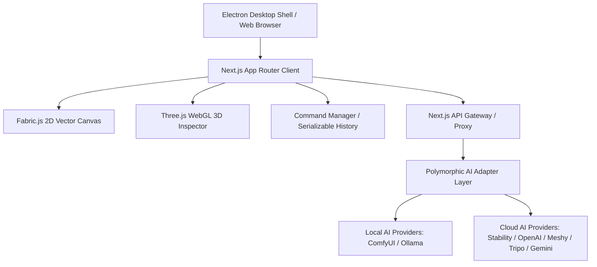

# Image Express - Open Source AI Design Studio

Image Express is a professional content creation platform built with Next.js 16, TypeScript, Tailwind CSS, and Fabric.js. It seamlessly integrates 2D design with AI-powered 3D model generation.

**Open Source Project by [GeekatplayStudio](https://github.com/GeekatplayStudio)**

## 🌟 Connect with Us

- **GitHub Repository**: [GeekatplayStudio](https://github.com/GeekatplayStudio)
- **LinkedIn**: [Geekatplay](https://www.linkedin.com/in/geekatplay/)
- **YouTube (English)**: [@geekatplay](https://www.youtube.com/@geekatplay)
- **YouTube (Russian)**: [@geekatplay-ru](https://www.youtube.com/@geekatplay-ru)
- **Website**: [Geekatplay.com](https://www.geekatplay.com)
- **Photography**: [ChopinePhotography.com](https://www.chopinephotography.com)

---

## 🛠️ Engineering Case Study

### Executive Summary
* **Problem**: Digital design workflows are typically fractured. Designers are forced to toggle between vector editors (e.g., Photoshop, Illustrator) for canvas layouts, separate WebGL environments for 3D staging, and distinct web interfaces (e.g., ComfyUI, Automatic1111) for generative AI tasks.
* **Why Created**: Image Express was built to unify these disparate pipelines into a single, high-performance open-source platform. It bridges interactive 2D canvas layouts, live WebGL 3D inspectors, and multi-provider AI generators (local Ollama/ComfyUI alongside cloud Meshy/Tripo/Stability/OpenAI pathways) under a single UI.
* **Who it is for**: Digital creators, visual designers, and developers looking for a customizable, extensible design suite that exposes professional vector, brush, and AI controls.
* **Technical Interest**: Integrating a stateful 2D canvas (Fabric.js) with real-time 3D environments (Three.js), sandboxed desktop environments (Electron), and distributed, high-latency generative AI routes.

---

### Engineering Challenge
* **Context Synchronization**: Managing coordinate systems and transformation matrices across independent 2D vector layouts and WebGL 3D scenes. When 3D layers are resized, scaled, or rotated, matrix math must translate user gestures from canvas coordinate space to WebGL clip space in real-time.
* **Hybrid Execution & Network Fallbacks**: Transitioning dynamically between high-throughput cloud endpoints and local instances (ComfyUI, Ollama). The app must support Docker loopbacks (resolving local targets between `localhost` and `host.docker.internal`), handle transient service outages with server-side retries, and manage model downloads/installations inline.
* **Memory & Layout Overhead**: Running high-resolution canvas brush engines (Spot Healing, Dodge, Burn, Clone Stamp), complex non-destructive raster masking, and nested vector folders without triggering browser memory leaks or dropping frame rates in Electron.

---

### Architecture Overview
Image Express uses a modular, decoupled architecture separating canvas layouts, AI adapters, and application runtimes.



* **Canvas Engine**: Standard Fabric.js core extended with custom subclass renderers (e.g., `WarpedImage` for perspective transformations, custom prototype extensions for styled text layout cards).
* **AI Abstraction Layer (`AiRuntimeManager`)**: A polymorphic adapter framework separating the front-end from individual generation APIs. It normalizes inputs and outputs, manages async polling states, and simplifies provider selection.
* **Command Pattern Engine**: Tracks every user canvas interaction (moves, resizing, properties) as discrete, serializable command payloads. This provides a clear audit trail and enables reliable undo/redo capabilities.

---

### Technology Choices
* **Next.js 16 (App Router) & TypeScript**: Provides a robust SSR framework combined with static type safety. TypeScript coordinates complex Fabric interface configurations (`ExtendedFabricObject`) and ensures strict API contracts for polymorphic AI payloads.
* **Fabric.js**: Selected as the 2D layout engine for its out-of-the-box object tree, mouse event handling, vector controls, and serialization/cloning support.
  * *Alternatives Considered*: Native HTML5 Canvas API (rejected due to the excessive overhead of rebuilding selection bounds, multi-select, scaling anchors, and layered object rendering from scratch). Pixi.js (rejected because its WebGL focus makes vector editing, text path alignments, and standard SVG rendering overly complex).
* **Three.js & React Three Fiber**: Used for the WebGL 3D layer inspector overlay. Provides high-fidelity rendering, lighting controls, shadow maps, and PBR textures within a canvas container.
* **Electron**: Wraps the web application into a sandboxed desktop container, unlocking native filesystem access, automatic updates, and hardware acceleration.

---

### Key Engineering Decisions
* **Polymorphic AI Adapter Pattern**: To prevent API-specific leakage into React views, all generative actions run through `AiRuntimeManager`. This normalizes disparate responses into a unified structure, allowing hot-swapping between cloud engines and local models (e.g., local Ollama for SVG layouts vs. OpenAI or Stability).
* **Prototype-Injected Text Background Rendering**: Instead of writing separate wrapper groups that must manually re-align whenever text is modified, we patched `_render` directly on `fabric.IText` and `fabric.Textbox` prototypes. This intercepts the Fabric draw call, dynamically rendering styled rectangles, capsule pills, or speech bubble frames behind the text glyphs in real-time as the user types.
* **Centralized Command Persistence**: All editor actions are serialized to JSON commands. This makes the workspace history replayable, supports automated offline dry-runs for quality testing, and prepares the codebase for future real-time collaborative syncing.

---

### Tradeoffs
* **Canvas Overlay vs. Native Grouping for 3D Layers**:
  * *Decision*: Rendered the 3D WebGL runtime in a HTML container positioned directly over the active 2D layer, rather than mapping 3D rendering cycles directly into Fabric's 2D context.
  * *Tradeoff*: Ensures highly performant lighting, environment maps, and rotation animations. However, it requires coordinate synchronization helpers to align the WebGL container position and dimensions with the 2D bounding boxes on canvas zoom or drag.
* **Next.js API Gateway as Proxy Tier**:
  * *Decision*: All AI generation and storage requests pass through local Next.js API endpoints.
  * *Tradeoff*: Prevents client-side CORS failures and keeps private API keys secure. However, it introduces a minor routing latency and memory overhead on the server when transferring heavy high-resolution image assets or 3D files.

---

### Interesting Technical Problems
* **Photoshop-Style Path Pen Loop Closure**:
  * *Problem*: When using the Pen tool to draw vector layouts, closing the shape by clicking the initial anchor point was unreliable, causing unclosed paths.
  * *Solution*: Implemented a fuzzy-coordinate threshold check (20px radius) and anchor index evaluation (`index === 0`). When triggered, the engine terminates draft drawing, compiles path nodes, sets the `penClosed` flag, and applies standard fill colors dynamically.
* **Text Circular Arcs & 360-Degree Wraps**:
  * *Problem*: Traditional text-on-path implementations using quadratic Bezier curves (`Q`) are constrained to soft curves and cannot wrap past $180^\circ$ to form a closed circle.
  * *Solution*: Replaced the parabolic curve math with SVG Arc commands (`A`) configured with radius $R = L/\theta$, swept flags, and large-arc thresholds ($>180^\circ$). This aligns text glyphs seamlessly up to a full $359.5^\circ$ circle.

---

### Performance & Scalability
* **Clipping Mask Render Optimization**: Complex nested vector masks degrade layout frames. The engine caches path clip states and limits recalculation to selected or actively edited layers.
* **Asynchronous Polling & Socket Management**: 3D generation can take minutes. The background scheduler uses async polling with exponential backoff and supports abort controllers to release socket pools immediately when jobs are cancelled.

---

### Lessons Learned
* **Proactive Component Extraction**: The primary editor file (`EditorView.tsx`) originally grew to over 7.4k lines, making it difficult to maintain. Extracting state, shortcuts, canvas wrappers, and history controls into dedicated hooks and components early in the project lifecycle is essential.
* **Subclassing vs. Prototype Modification**: While prototype patching (e.g., for Text Backgrounds) is quick, it can lead to prototype clutter. A future iteration will refactor these into formal Fabric subclasses (e.g., `fabric.TextBoxWithFrame`) to clean up namespace collisions.

---

## 🚀 Key Features

### Studio & Design
- **Modern Dashboard**: Redesigned home screen with quick-start templates (Instagram, YouTube, A4), recent designs grid, and community support links.
- **Infinite Canvas**: Advanced vector workspace using Fabric.js.
- **Layer Management**: Professional locking, visibility, reordering, multi-select, and folder organization with a cleaner action strip, selected-layer inspector toggle (X/Y/W/H), and explicit Arrange Layers mode.
- **Paint Folders**: Each paint session is grouped into a single folder; switching tools starts a new paint folder automatically.
- **Advanced Masking**: Non-destructive masking functionality. Select two objects to mask the bottom one with the top one; includes support for inverting masks.
- **Interactive Tools**: Gradient editor, expanded shapes (including cloud/thought bubble/hexagon/diamond), and text manipulation with multiline text editing in properties.
- **Perspective Presets**: Selected layers can switch between Front and Back presentation in Properties to fake a backside view without adding extra skew.
- **Retouching Suite**: Comprehensive canvas manipulation tools including Spot Healing, Remove, Clone Stamp, Blur, Sharpen, Dodge, Burn, Sponge, and History Brush.
- **Export Options**: Export designs to PNG, JPG, SVG, PDF, JSON, and self-contained HTML bundles with all assets rewritten for offline playback.
- **In-App Manual**: Contextual help modal with persistent chapter navigation and quick close actions.
- **Workspace Crop & Picker Reliability**:
  - Crop supports direct drag-draft selection in canvas workspace and apply-from-top controls.
  - Eyedropper samples from clicked canvas points without switching layer selection state.
  - Picker launches an expanded color wheel panel with harmony modes (complementary/triadic/tetradic/etc.) and saved swatches.

### AI Capabilities
- **Advanced 3D Generation**: 
  - Integrated **Meshy**, **Tripo**, and **Hitem3D** AI for high-quality 3D models.
  - **Interactive 3D Layer Editor**: Rotate, pan, and arrange 3D models seamlessly on the canvas with customizable environment lighting, shadows, and resolution.
  - **Textured Models**: Enforced PBR texture generation for realistic results.
  - **Background Processing**: Robust polling system for long-running AI tasks.
- **Image Generation**: Provider-routed generation via ComfyUI, Stability, and OpenAI pathways.
- **Google Gemini Image Generation**: The shared generator route now supports Gemini image generation using your saved Google API key, including aspect-ratio mapping for the current prompt zone.
- **Local AI Critique with Ollama**:
   - Persist local runtime settings for Ollama base URL and preferred model in Settings.
   - Server-side Ollama routes retry transient network failures and hop between `localhost` and `host.docker.internal`, so the same saved setting can work when the app runs either directly on the host or inside Docker.
   - Use Ollama as a first-pass local SVG generation provider in the shared image-generation modal.
   - Run local critique against either the selected layer or the full canvas from the toolbar.
   - Validate local model availability before sending critique requests.
   - If the configured model is missing, the app now offers an inline install action in Settings, AI Critique, and Ollama generation flows.
   - Run `npm run qa:ollama` to hit the live status, generation, and critique routes against a running app and local Ollama runtime.
- **ComfyUI Workflow Library & Proxying**:
   - Browse runnable server templates plus custom workflow-folder JSON imports from the app.
   - Inspect and manage configured Comfy custom-node/workflow repositories.
   - Use a same-origin Comfy proxy with loopback fallback handling for Docker/host setups.
   - Local Comfy generation now verifies runtime availability before source capture or warmup and shows an inline status error when the configured server is unreachable.
   - Image-based Comfy tasks hide the visible AI zone overlay during source export and now stop early if the captured source is almost entirely blank.
   - Standard local Comfy runs persist the last prepared request snapshot in browser localStorage under `image-express-comfy-last-request`, including prepared positive/negative prompt text plus workflow and model metadata.
   - `custom_nodes` and workflow-library settings can be entered as relative child paths of the configured Comfy install folder, which simplifies Docker-mounted installs.
- **AI Edit Notes (Beta)**:
   - Create a reference layer directly from the currently selected canvas layer.
   - Annotate with a large notes workspace using point/manual notes.
   - Remove point notes quickly with right-click and restore with Undo.
   - Save a flattened reference-notes layer back to canvas with embedded instruction metadata (`aiEditPlanData`) for downstream ComfyUI handoff.
   - Long-running jobs support manual abort and extended wait windows for heavy Comfy/Flux runs.
   - Comfy recovery now supports explicit cancellation and avoids auto-resuming canceled prompt IDs.
   - Aspect controls support a free custom primary value with model-adapted sizing guidance for render-time bucket alignment.

### Storage & Management
- **Server-Side Design Storage**: Designs are saved securely on the server (via filesystem in this edition), bypassing browser storage limits.
- **Asset Library**: 
  - Upload, organize, and manage images and 3D models.
   - AI-generated and AI-processed outputs now save through the active storage mode, so they appear in the local library, Google Drive, or both according to current storage settings.
  - **3D Previews**: Hover over any 3D model asset to see a real-time rotating 3D preview popup.
  - **Renaming System**: Interactive renaming overlay for assets.
- **Authentication**: Secure login system with server-side key persistence for API access.
- **Profile Security**: Signed-in web accounts can change their password directly from the User Profile modal with current-password verification.
- **Session Security**: Automatic 30-minute inactivity timeout for guest and web users to protect sessions.
- **Audit Logging**: Automatic login activity logging with IP and user agent; viewable from Settings.
- **Desktop Shell**: Single-codebase Electron build with auto-update checks and in-app update prompts.
- **Optional Drive Backup**: One-click Google Drive integration to mirror saved designs into your personal Drive folder.

## 🚀 Deployment

### ⚡ One-Click Launcher (Recommended)

The easiest way to run Image Express — no terminal required. Double-click:

* **macOS**: `LaunchImageExpress.command`
* **Windows**: `LaunchImageExpress.bat`

This single click will:
1. Check that Node.js is installed (and tell you where to get it if not).
2. Pull the latest updates from GitHub, if it's safe to do so (skips automatically if you have local changes or a diverged branch, so it never overwrites your work).
3. Install/update dependencies only when needed (fast on repeat runs).
4. Build and start the app, then open it in your browser automatically.

On first run on macOS, right-click the `.command` file and choose **Open** once to satisfy Gatekeeper; after that, double-clicking works normally.

### 🛠️ Interactive Scripts (Start & Build)

For convenience, helper scripts are provided to start and build the application on macOS, Linux, and Windows. They automatically check for dependencies (`node_modules`) and prompt to install them if missing, then offer an interactive menu of start/build options (Desktop/Web and Development/Production modes).

#### On macOS / Linux (Standard Terminal):
On macOS, it is normal and recommended to run commands directly via `npm`, but you can also use the interactive shell scripts:
* **Interactive Start**: `./start.sh`
* **Interactive Build**: `./build.sh`
* **Normal Web Dev**: `npm run dev` (Starts development server on [http://localhost:3000](http://localhost:3000))
* **Normal Web Prod Build**: `npm run build` && `npm run start`
* **Normal Desktop Dev**: `npm run desktop:dev` (Starts local Next.js dev server and launches Electron app)
* **Normal Desktop Build**: `npm run desktop:build` (Builds and packages desktop installers)

#### On Windows (PC):
* **Interactive Start**: Run `start.bat` (from command line/PowerShell or by double-clicking it)
* **Interactive Build**: Run `build.bat` (from command line/PowerShell or by double-clicking it)

### Quick Start (Local)

1. **Install dependencies**:
   ```bash
   npm install
   ```

2. **Run the development server**:
   ```bash
   npm run dev
   ```

3. **Open the app**:
   Visit [http://localhost:3000](http://localhost:3000) (or port 3001 if 3000 is busy).

### Desktop App (macOS & Windows)

Run Image Express as a standalone desktop application without manual login on localhost.

1. **Install dependencies** (once):
   ```bash
   npm install
   ```
2. **Desktop development mode** (hot reload for both Next.js and Electron):
   ```bash
   npm run desktop:dev
   ```
3. **Desktop production preview** (build + serve the desktop shell):
   ```bash
   npm run desktop:start
   ```
   This command runs `next build`, boots the standalone Next.js server on port 3927, and launches Electron.
4. **Create installers** (macOS DMG, Windows NSIS, Linux AppImage):
   ```bash
   npm run desktop:build
   ```

Inside the packaged app the Settings modal exposes “Desktop Updates” so users can manually check for new releases. Automatic checks run shortly after startup and every six hours; when an update finishes downloading the modal offers a restart button to install it.

### 🔑 API Key Configuration

To unlock full AI capabilities, you need to configure your API keys in the **Settings** menu. Keys are stored locally in your browser for security.

1. **Open Settings**: Click the gear icon in the top-right corner of the Hub or Editor.
2. **Navigate to API Keys**: Select the relevant tab (3D Services or Image Services).
3. **Enter Keys**: Paste your keys and click Save.

#### Supported Services:

**3D Generation (Text-to-3D):**
- **[Meshy AI](https://www.meshy.ai/)**: Get your key from the Meshy Dashboard.
- **[Tripo AI](https://www.tripo3d.ai/)**: Sign up and generate an API key.
- **[Hy3D / Hitems](https://www.hitems.com/)**: Professional text-to-3D service. Supports either bearer token or `access_key:secret_key`. `hitems_appid` is optional and only required for some accounts.

**2D Generation (Text-to-Image):**
- **[Stability AI](https://platform.stability.ai/)**: For Stable Diffusion generation.
- **[OpenAI](https://platform.openai.com/)**: For DALL-E 3 integration.
- **Comfy Cloud**: The app can bootstrap `COMFY_CLOUD_URL` and `COMFY_CLOUD_API_KEY` from runtime env for both host and Docker runs. Free-tier Comfy Cloud accounts currently reject API-key authentication, so a saved key alone will still return the provider error reported by Comfy Cloud until that account tier supports API access.

### Provider Key Validation (Settings)

The Settings modal now includes built-in key validation before generation:

- **Hitem3D**: server-side validation through `/api/ai/hitems/validate`.
- **Meshy / Tripo / Google**: local preflight format checks to catch obvious key mistakes early.

For Hitem3D, use **AK/SK mode** with `ak_...` + `sk_...` or **Token mode** with a bearer token. Successful Hitem validation stores normalized values for immediate use by the generator.

### Optional: Google Drive Backups

Keep a personal copy of every saved design in your Google Drive without exposing your credentials to the server.

1. Create an OAuth **Web application** in Google Cloud Console and note the **Client ID**.
2. Add the authorized JavaScript origins that match your dev/prod domains (e.g., `http://localhost:3000`).
3. Either set the environment variable before starting the app _or_ paste the Client ID directly into the Settings modal:
   ```bash
   export NEXT_PUBLIC_GOOGLE_DRIVE_CLIENT_ID="your-client-id.apps.googleusercontent.com"
   ```
   Creating a `.env.local` works too; if omitted, you can paste the ID into **Settings → Google Drive Backup** and it will be stored locally.
4. Google login reuses the same stored Client ID. In Docker or other production builds where `NEXT_PUBLIC_GOOGLE_AUTH_CLIENT_ID` is not baked into the image, the login modal will use the Client ID saved in Settings.
5. Run the app and open **Settings → Google Drive Backup → Connect** to approve access.
6. After connecting, every successful save keeps the local copy and uploads a JSON snapshot (with thumbnail metadata) to the `Image Express Backups` folder in your Drive.

### Docker Deployment

This project includes a `Dockerfile` optimized for production.

1. **Build**: 
   ```bash
   docker build -t image-express .
   ```
2. **Run**: 
   ```bash
   docker run -p 3000:3000 \
     -e COMFY_CLOUD_URL="https://cloud.comfy.org" \
     -e COMFY_CLOUD_API_KEY="your-comfy-cloud-key" \
     image-express
   ```

For local ComfyUI folder management inside Docker, mount your Comfy install, `custom_nodes` folder, and optional workflow-library folder into the container. The configured install path must match the container-visible mount path, and relative `custom_nodes` / workflow-library values resolve from that install folder. If ComfyUI itself runs on the host machine, prefer `host.docker.internal` over `localhost` for server-side template scans.

For host installs outside Docker, creating a local `.env.local` with the same `COMFY_CLOUD_URL` and `COMFY_CLOUD_API_KEY` values is enough for the app to preload the cloud configuration.

## 🏗 Project Structure

- **`src/app`**:
  - `page.tsx`: Main layout handling views (Dashboard vs Editor).
  - `api/`: Backend routes for AI proxies, assets, and **design persistence**.
    - `api/designs/`: Endpoints for saving, listing, and deleting designs server-side.
- **`src/components`**:
  - `Dashboard.tsx`: Template selector and home view.
  - `DesignCanvas.tsx`: Core Fabric.js workspace.
  - `ThreeDGenerator.tsx`: AI integration panel.
  - `PropertiesPanel.tsx`: Context-aware editing sidebar.
  - `properties/`: Modular property editors (Shadow, Stroke, Text, Filters, etc.)

## 🎨 Properties Panel Features

The Properties Panel provides comprehensive editing capabilities:

### Adjustment Layers
- **Curves**: Spline-based color correction with per-channel control
- **Levels**: Black/Mid/White point adjustment
- **Exposure**: Brightness and contrast control
- **Hue/Saturation**: Color shift and intensity
- **Brightness/Contrast**: Dedicated tonal sliders
- **Color Balance**: RGB channel balancing with preserve-luminosity support
- **Light and Color**: Unified temperature/tint/exposure/saturation/vibrance control
- **Solid Color**: Blend-based color fill adjustment layer
- **Black & White**: Grayscale conversion

### Color & Swatches
- **Right Panel Color Wheel**: Embedded color wheel in properties color panel with live preview behavior
- **Channel Editing Modes**: Editable RGB / HSB / CMYK / Lab value cards
- **Profile Preview Modes**: sRGB, Adobe RGB, and CMYK print-preview context
- **Harmony Sets**: Save, rename, delete, import, and export harmony palettes
- **Grouped Swatches**: Create, select, and remove swatch groups directly in the Swatches panel, plus add/remove swatches per group
- **Mask Gradient Controls**: Clip-path masks support non-destructive linear or radial opacity fades with editable angle/start/end opacity.

### Channels
- **Real Channels Panel**: Composite, Red, Green, Blue, Alpha, and Luminosity rows are available in the right rail and circular context menu.
- **Per-Channel Controls**: Each editable channel supports opacity, composite masking, isolate, invert, and mask actions.
- **Layer-Aware Behavior**: Selected images use non-destructive ColorMatrix filters, while fillable layers and solid-color adjustments support direct per-channel value edits.

### AI Providers
- **Google Gemini**: Shared zone generation route is live for image generation with the saved Google API key.
- **Banana.dev**: Shared zone generation route is live when the server is configured with a Banana endpoint and the user has saved a Banana API key.
- **NanoBanana**: AI Edit Notes can now route direct edit jobs through the Banana runtime instead of returning the earlier stub image.

### Shadow & Stroke
- **Drop Shadow**: Blur (0-150px), Offset (±200px), Opacity, Blend Modes
- **Inside Stroke**: Renders over fill
- **Outside Border**: Renders under fill (paintFirst: stroke)

### Text Tools
- **Curved Text**: Quadratic/Cubic bezier paths with presets (Flat, Arc↑, Arc↓, Circle)
- **13 Font Families**: Arial, Times New Roman, Georgia, Impact, and more
- **Font Weights**: 100-900 plus normal/bold

### Paint Mode
- **Brush Types**: Pencil, Spray, Oil, Watercolor
- **Blend Modes**: Normal, Multiply, Screen, Overlay
- **Smart Grouping**: Strokes auto-grouped in Paint Folders

### Photoshop-Style Shortcuts
- **Navigation**: Space + Drag pans, Scroll zooms, and Double-click empty canvas recenters the artboard.
- **Layer Duplication**: Alt/Option + Drag duplicates the selected layer and drags the copy.
- **Selection Tools**: `V` Move, `M` Marquee, `L` Lasso, `W` Quick Selection, `Shift+W` Magic Wand, `A` Path Select.
- **Creation & Retouch**: `T` Text, `U` Shapes, `P` Pen, `B` Brush, `R` Blur, `J` Healing, `S` Clone Stamp, `O` Dodge, `G` Gradient, `I` Eyedropper, `C` Crop, `H` Hand, `Z` Zoom.
- **History & Selection**: `Cmd/Ctrl+J` duplicates, `Cmd/Ctrl+D` deselects, `Cmd/Ctrl+Z` and `Cmd/Ctrl+Alt+Z` undo, `Cmd/Ctrl+Shift+Z` redo.

## 🛠 Tech Stack

- **Framework**: Next.js 16 (App Router)
- **Language**: TypeScript
- **Styling**: Tailwind CSS
- **Graphics**: Fabric.js (2D), Three.js / React Three Fiber (3D)
- **Icons**: Lucide React

## 📚 Documentation

- Easy install guide (PC/Mac + optional ComfyUI/Ollama): [docs/INSTALLATION.md](docs/INSTALLATION.md)
- HTML export details, asset coverage, and QA guidance: [docs/html-export-notes.md](docs/html-export-notes.md)
- Current implementation status and handoff checkpoint: [docs/unified_progress_status.md](docs/unified_progress_status.md)
- Editor ownership map for ongoing refactors: [docs/component_responsibility_map.md](docs/component_responsibility_map.md)
- Current large-component audit and extraction plan: [docs/refactor_component_audit_2026-02-26.md](docs/refactor_component_audit_2026-02-26.md)
- Current repo maintenance audit snapshot: [docs/repo_maintenance_audit.md](docs/repo_maintenance_audit.md)
- Latest release notes (Apr 2 2026): [docs/release_notes_2026-04-02.md](docs/release_notes_2026-04-02.md)

Validation status as of 2026-04-02:
- `npm.cmd test -- --runInBand --ci` -> 57/57 suites passed on the latest full-suite validation run
- `npm.cmd test -- --runInBand src/components/__tests__/imageGeneratorModalUtils.test.ts src/lib/__tests__/ollamaServer.test.ts src/lib/comfyui/__tests__/registry.test.ts src/components/__tests__/PropertiesPanel.test.tsx src/components/properties/__tests__/SelectionProperties.test.tsx` -> passed (5 suites / 26 tests)
- `npm.cmd run build` -> passed
- Docker image rebuilt and `image-express-app` returned HTTP 200 on port 3000

Maintenance audit:
- `npm run audit:repo` -> reports oversized source/test files, large modules without a direct same-name test heuristic, and runtime `coming soon` / `not implemented yet` markers.
- `npm run qa:ollama` -> exercises the live Ollama status, generation, and critique routes against the running app.
- `npm run qa:overlay` -> runs the browser-level export and media-overlay verification suites.
- Playwright output folders such as `test-results/` and `playwright-report/` are intentionally ignored.
- Current generated-asset saves, Comfy/Ollama runtime fallbacks, navigator thumbnail preview, and circular-context-menu sync are all tracked in the latest release notes.

## Editor Refactor Status

- `src/components/Editor/EditorView.tsx` has been reduced from 7,453 lines to 1,337 lines through progressive hook and component extraction.
- Header, menu, overlay, workspace shell, workspace canvas, panel shell, export support, selection interactions, retouch interactions, and shell side-effects are now owned by dedicated modules under `src/components/Editor/`.
- The canonical refactor handoff documents are:
  - `docs/component_responsibility_map.md`
  - `docs/refactor_component_audit_2026-02-26.md`
  - `docs/feature_implementation_tracker.md`
  - `docs/unified_progress_status.md`
