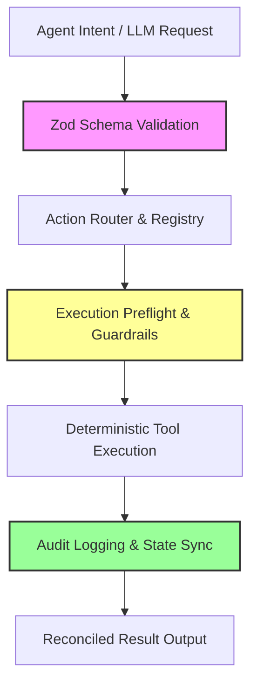

# Architectural Guide: Guardrailed & Controlled AI Agentic Projects

This document provides a comprehensive architectural blueprint to transform **Image Express** into a gold standard example of a **guardrailed, deterministic, and controlled AI agentic system**. 

Modern agentic systems must move away from unpredictable "black-box" prompts and ad-hoc API integrations. Instead, they require strict execution boundaries, structured data exchange, sandbox-ready simulation, and robust execution auditing.

---

## 1. Core Architectural Pillars of Controlled Agentic AI

A truly enterprise-grade, deterministic AI agentic project rests on five architectural pillars:



### 1. Structured & Typed API Specifications (Data Guardrails)
- **Problem**: Natural language prompts and unchecked model outputs introduce unpredictable data structures, leading to parser crashes and unexpected UI behavior.
- **Solution**: Enforce strict validation using libraries like **Zod** or **TypeBox** at the input/output boundaries of all agent interactions. Any output from an LLM or ComfyUI workflow must conform to a schema before it is allowed to touch application state or the canvas.

### 2. Executable Action Registries (Deterministic Tool-use)
- **Problem**: Agents with direct access to file systems or internal code execution run the risk of unconstrained behaviors or infinite loops.
- **Solution**: Implement a **Command Pattern** / **Action Registry**. The agent can *only* emit a payload describing the *intent* to perform an action (e.g., `{"command": "resizeLayer", "args": {"id": 12, "width": 800}}`). A secure execution driver parses this message, validates permissions, and executes the local TypeScript function. The agent never executes code directly.

### 3. Execution Preflight & Sandboxing (Pre-execution Safety)
- **Problem**: Calling external generative AI endpoints (e.g., ComfyUI, Ollama, Gemini) is expensive, slow, and prone to runtime failures.
- **Solution**: Require **Preflight Checks** (e.g., server ping, dependency audits, model availability verification) and support **Dry-Run/Mock Modes**. This allows developer agents and E2E test suites to simulate full generation runs instantly and deterministically without wasting cloud credits or hitting API limits.

### 4. Stateful Transaction Logging & Recovery (State Guardrails)
- **Problem**: Disconnected or crashed agent processes leave background jobs orphaned, wasting server-side computation.
- **Solution**: Use a centralized transactional registry (like the `ai-jobs` database in this repo) with state machines (e.g., `pending` -> `processing` -> `completed` / `failed` / `cancelled`). Every request must carry an idempotency key to prevent double-submissions, and provide explicit termination hooks to clean up local artifacts upon cancellation.

### 5. Multi-layer Compliance & Safety Filters (Content Guardrails)
- **Problem**: Generative tasks can output corrupted formats, invalid SVG structures, or content that violates safety policies.
- **Solution**: Implement automated content/geometry checks:
  - **SVG Sanitization**: Parse raw SVGs returned by LLMs (like Ollama SVG generator) using strict validators to remove script tags or inline event listeners.
  - **Geometry Sizing Bucket Alignment**: Automatically map random canvas selections to the closest dimensions optimized for the active generative model (e.g., SDXL/Flux bucket alignment).

---

## 2. Evaluation of Image Express's AI Architecture

### Existing Strengths in Image Express
1. **Preflight Checking**: The codebase checks ComfyUI and Ollama availability before starting tasks.
2. **State Storage**: The application tracks async tasks via `useBackgroundJobsStore`, `data/ai-jobs`, and `data/ai-revisions`.
3. **Local Fallbacks**: Server routes safely fall back between `localhost` and `host.docker.internal` for Docker-to-host communications.
4. **Credential Isolation**: Phase-1 user key-vault storage is decoupled from the web application state and stored securely on the filesystem with encryption.

### Opportunities for Parity & Improvement
1. **Scattered Provider Logic**: Generative endpoints are split across multiple files (`src/components/ThreeDGenerator.tsx`, `src/components/AI/StabilityGenerator.tsx`, `src/app/api/ai/generate-image/route.ts`).
2. **Implicit Payload Mapping**: ComfyUI templates are coupled to specific files rather than loaded dynamically from a typed registry.
3. **Unsanitized SVGs**: Local Ollama SVG generation outputs are placed on the canvas without verification that the SVG string is clean and structurally complete.

---

## 3. Recommended Refactoring to Achieve "Gold Standard"

To achieve absolute deterministic control, the following directory structure improvements are recommended:

### 1. Move Agent Prompts & System Rules into `.agents` configuration
Create a version-controlled directory for agent behaviors, keeping instructions separate from the code:
- `.agents/rules/canvas-agent.md`: Constraints for the agent operating on Fabric.js.
- `.agents/rules/generation-agent.md`: Constraints for prompt construction and aspect-ratio mapping.
- `.agents/rules/critique-agent.md`: Strict rules for Ollama visual critique prompts, dictating structured JSON-only output.

### 2. Introduce a Unified AI Generation Client (`src/lib/ai/runtime.ts`)
Consolidate separate AI generation scripts into a single polymorphic runtime manager:

```typescript
// Proposed src/lib/ai/types.ts
import { z } from 'zod';

export const GenerationParamsSchema = z.object({
  provider: z.enum(['stability', 'openai', 'gemini', 'ollama', 'comfyui']),
  prompt: z.string().min(1),
  aspectRatio: z.string().optional(),
  width: z.number().int().positive(),
  height: z.number().int().positive(),
  mockMode: z.boolean().default(false),
});

export type GenerationParams = z.infer<typeof GenerationParamsSchema>;
```

```typescript
// Proposed src/lib/ai/runtime.ts
import { GenerationParams } from './types';

export class AiRuntimeManager {
  static async generateImage(params: GenerationParams): Promise<{ imageUrl: string; provider: string }> {
    // 1. Enforce validation bounds
    const validParams = GenerationParamsSchema.parse(params);
    
    if (validParams.mockMode) {
      return { imageUrl: `/mock-assets/${validParams.provider}-placeholder.png`, provider: validParams.provider };
    }

    // 2. Resolve provider adapter dynamically
    const adapter = ProviderAdapterRegistry.get(validParams.provider);
    
    // 3. Execute preflight check
    await adapter.preflight();
    
    // 4. Perform generation with retry policy and logs
    return await adapter.execute(validParams);
  }
}
```

### 3. Standardize Command Interfaces via the Command Pattern
To control layout updates, direct manipulations should flow through a command dispatcher:

```typescript
interface Command {
  execute(canvas: fabric.Canvas): void;
  undo(canvas: fabric.Canvas): void;
}

export class ResizeObjectCommand implements Command {
  constructor(private objectId: string, private newWidth: number, private newHeight: number) {}
  
  execute(canvas: fabric.Canvas) {
    const obj = canvas.getObjects().find(o => o.get('id') === this.objectId);
    if (obj) {
      obj.set({ width: this.newWidth, height: this.newHeight });
      canvas.requestRenderAll();
    }
  }
  // ... undo implementation ...
}
```

By ensuring all changes run through a validated command pipeline, any external developer agent can test operations offline by reviewing command history without rendering canvas pixels.

---

## 4. Summary Checklist for Future Agent Integrations

When extending this repository with new AI agent capabilities, engineers should adhere to this checklist:
- [ ] **Define Schema**: Check/write input schemas using `zod` for the agent's action payload.
- [ ] **Provide Mocks**: Ensure the endpoint supports `mockMode` or returns static fixtures during tests.
- [ ] **Writhe Preflights**: Hook into standard health checks (e.g., `host.docker.internal` loopback checks).
- [ ] **Sanitize Output**: Run outputs (SVGs, text templates) through structural parsers before appending to layers.
- [ ] **Log Executions**: Record request payloads under `.image-express-comfy-last-request` or `logs/` for offline auditing.
