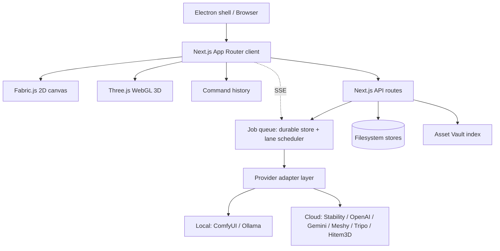

# Image Express — Architecture Reference

**This is the master reference for how the system works.** Read it before
changing runtime code.

- What the app *does* for a user: [FUNCTIONALITY.md](FUNCTIONALITY.md)
- What we're building next: [ROADMAP.md](ROADMAP.md)
- What things are called: [TERMINOLOGY.md](TERMINOLOGY.md)
- What already shipped: [CHANGELOG.md](CHANGELOG.md)

---

## 1. Shape of the system

Image Express is a single Next.js 16 (App Router) application that runs in three
places from one codebase: a browser, a local loopback web server, and an
Electron desktop shell. There is no separate backend service — the Next server
*is* the backend, and on a local install it runs on the user's own machine.

That single fact drives most of the design decisions below: the "server" and
"the user's computer" are usually the same machine, so the app can index local
drives and spawn local runtimes — but it must fail closed when that assumption
does not hold.



### Runtime profiles

`src/lib/server/runtimeProfile.ts` resolves one of three profiles. Everything
security-sensitive keys off it.

| Profile | When | Filesystem access |
|---|---|---|
| `desktop-local` | Electron (`NEXT_DESKTOP=1`) | All drives |
| `developer-local` | `npm run dev`, and `npm run start` (declared by `start-web.mjs`) | All drives |
| `self-hosted` | `NODE_ENV=production` with no explicit profile; Docker sets it explicitly | **Nothing** unless `IMAGE_EXPRESS_VAULT_ALLOWED_ROOTS` lists it |

`self-hosted` fails closed by design: an unset allowlist means "authorise
nothing", never "allow everything". Both local launchers bind `127.0.0.1`
only, which is what makes granting them full filesystem access safe.

> **Historical trap.** `next start` sets `NODE_ENV=production`, so a local user
> running `npm run start` was classified `self-hosted` and every
> `/api/assets/vault/file` request returned 403 for their own indexed files.
> `scripts/start-web.mjs` now declares its profile explicitly. Pinned by tests
> in `__tests__/start-web-runtime-profile.test.ts` and
> `src/lib/server/__tests__/runtimeProfile.test.ts`.

---

## 2. The "Q" — unified job queue

Long-running AI work never runs inside a request handler. This section is the
full contract; the design rationale and Adobe comparison live in
[JOB_QUEUE.md](JOB_QUEUE.md).

### Why it exists

Before the queue, `POST /api/generate` called `void processGenerateJob(id)`
directly in the request handler. That meant no concurrency cap (five clicks =
five concurrent provider calls, which OOMs a local GPU), no crash recovery
(provider params lived in a module-level `Map` that HMR and restarts wiped, so
interrupted jobs reported `running` forever), and `GET /api/jobs/:id/result`
deleted the result on first read.

### The nine stages

Every job moves through the same pipeline, and the UI names these stages:

```
Request → API → Queue → Worker → AI → Validate → Store → Notify → Retrieve
```

| Stage | Meaning |
|---|---|
| `request` | Client fired the action |
| `api` | Route accepted it (`202` + job id) and did **no** work |
| `queue` | Durable record written, waiting for a lane slot |
| `worker` | A lane slot opened; handler started |
| `ai` | Provider call in flight (local or remote) |
| `validate` | Output checked before it is trusted |
| `store` | Result written to durable storage |
| `notify` | Terminal transition pushed to clients |
| `retrieve` | Result addressable and re-fetchable |

### Status enum

`queued → running → succeeded | failed | cancelled`. Flat and small, following
Adobe Firefly Services' async job contract.

### Concurrency lanes

The single most important property. Lanes have independent caps so one slow
provider cannot starve another kind of work:

| Lane | Cap | Why |
|---|---|---|
| `local-gpu` | **1** | One GPU. Serialize or OOM. ComfyUI-backed providers (e.g. `flux`) live here. |
| `local-cpu` | 4 | Thumbnails, embeddings, vault indexing |
| `remote:<provider>` | 3 each | Per-provider window; `nanobanana`, `stability`, … |

Within a lane: priority first, then FIFO.

### Durability and crash recovery

- **Store**: `data/queue/jobs.json`, written atomically (temp file + rename),
  writes serialized on a promise chain. Terminal jobs pruned after 24h.
  `QueueStore` resolves its directory **once at construction** — resolving
  per-write let async writes land wherever `IMAGE_EXPRESS_DATA_DIR` pointed at
  flush time.
- **Leases**: a running job holds a lease that its own progress updates renew.
- **Boot recovery**: this is a single-process app, so any job persisted as
  `running` belonged to a dead process. It is failed as `interrupted` at
  startup. Zombie jobs are structurally impossible.
- **Singleton**: the scheduler is pinned to `globalThis` so Next.js dev HMR
  cannot orphan in-flight work. *Consequence:* editing `scheduler.ts` does not
  replace the live instance — restart the dev server after changing its shape.

### Transport: SSE, not polling

`GET /api/queue/stream` pushes every transition. Each connection opens with a
full snapshot, so a reconnect cannot miss a state change; `EventSource`
reconnects natively. `GET /api/queue` remains as a snapshot fallback.

### Job control

| Endpoint | Rule |
|---|---|
| `POST /api/queue/[id]/cancel` | Queued jobs only. Running → `409 job_not_cancellable`; handlers own their provider calls and cannot be interrupted safely. |
| `POST /api/queue/[id]/retry` | Failed or cancelled only; resets `attempts` to zero. Otherwise `409 job_not_retryable`. |

Two things make retry actually work: failed jobs **keep their uploads** (they
are the inputs a retry needs), and unredacted provider params survive in memory
for the process lifetime. After a restart those are gone, so retrying a
credentialed provider fails — by design, since persisting secrets is exactly
what redaction prevents.

### Adding a new kind of job

1. Write a handler `(ctx: QueueHandlerContext) => Promise<{resultUrl?} | void>`
   in `src/lib/server/jobQueue/handlers/`; call `ctx.update({stage, progress, message})`
   as it advances.
2. Register it in `src/lib/server/jobQueue/index.ts`.
3. Enqueue with `getQueue().enqueue({ kind, lane, external, label, payload })`.

Persistence, recovery, retries, SSE, the pipeline rail and notifications all
come for free. **Always import from `index.ts`**, never `scheduler.ts` directly,
or handler registration is skipped.

### Client surface

- `src/hooks/useQueueStream.ts` — the SSE subscription, callback-based so
  consumers update state inside external-event callbacks.
- `src/components/PipelineRail.tsx` — global 3px strip under the top toolbar,
  one segment per stage. Merges the server queue with the editor's
  localStorage background jobs, distinguishes External-API vs Local work,
  surfaces failure reasons inline, and offers cancel/retry.

### Known gap

Meshy/Tripo/Hitem3D/Stability 3D jobs are still polled **from the browser**
(`useBackgroundJobPolling`), so closing the tab abandons them and the
3-concurrent cap is per-tab. Migrating that into queue workers is the largest
open item — see [ROADMAP.md](ROADMAP.md).

---

## 3. Editor runtime

`src/components/Editor/EditorView.tsx` orchestrates; behaviour lives in
extracted hooks so the file stays navigable.

| Domain | Hook |
|---|---|
| Save / load / back-safety | `useEditorPersistence` |
| Export, share, quality modal | `useEditorExport` |
| Undo / redo / duplicate | `useEditorHistory` |
| Menu commands | `useEditorMenuActions` |
| Keyboard shortcuts | `useEditorKeyboardShortcuts` |
| Media overlay + campaign variants | `useMediaOverlay`, `useMediaOverlayCampaignVariants` |
| Background jobs | `useBackgroundJobsStore`, `useBackgroundJobPolling` |
| Selection / retouch pipelines | `useEditorCanvasSelectionInteractions`, `useEditorCanvasRetouchInteractions` |
| Top tool controls | `useEditorTopCanvasControls`, `useEditorShapeGradientControls` |
| 3D workspace | `useEditorThreeDWorkspace` |

Composition shells: `EditorWorkspaceShell` (tool rail, panels, job footer),
`EditorCanvasWorkspace` (canvas stage, overlays, utility cluster),
`EditorViewOverlays` (modals, including the Asset Vault).

### Canvas model

`DesignCanvas` owns a full-size Fabric canvas plus an explicit **artboard**
rect as a non-selectable base layer. The artboard is the export boundary; it is
kept at the bottom of the stack and excluded from selection and deletion.

The "Canvas W×H" badge resolves through
`resolveUtilityCanvasSize` in precedence order: scaled `artboardRect`, then
`artboard`, then the Fabric element divided by zoom. Only the last is the
viewport — a detail that silently broke a test when a shared stub gained an
artboard.

### Cross-canvas linked layers

Any layer can carry a `sharedLayerId`, broadcasting itself into every other
page — including across albums. Mutations fan out to every linked instance
without circular update loops. Bookshelves are a **hard resource boundary**:
linked layers never sync across shelves.

---

## 4. Asset Vault

Indexes assets **in place** across local drives without moving files.

- **Records**: `origin.uri` (`file://d:/…` or `server://…`) is canonical;
  `displayPath` is for display only and is not a clean path.
- **Watch roots**: `data/vault/watch-roots.json`. A file must sit inside a
  registered root *and* pass the runtime access policy — two independent gates,
  because this endpoint turns a path into bytes.
- **Scale**: a whole-drive scan is routinely ~200k assets. `DEFAULT_MAX_SCAN_FILES`
  caps one scan at 200,000.

### Semantic search: the vector store

`data/vault/vectors.db` — `src/lib/server/vaultVectorDb.ts`. It replaced
`vectors.json`, which did not merely get slow: a 768-dim `nomic-embed-text`
record serialises to ~15.6 KB, so the file hit V8's 536 MB maximum string length
at roughly **34,400 embedded assets** and `JSON.stringify` threw. The caller
caught that and warned, so past that point the index silently stopped
persisting and semantic search could never converge.

**Storage.** One row per vector, embedding held as a float32 BLOB — 3 KB rather
than 15.6 KB. Vectors are stored **unit-length**, which is what makes cosine
similarity a plain dot product. Writing one backfill batch of 32 costs ~3 ms
against a ~2.2 s rewrite of the whole file.

**Search is two-stage**, and the staging is the whole design:

1. An **int8 quantised** copy of the matrix is held in memory and scanned. At
   200k × 768 that is 154 MB, against 614 MB for float32.
2. The top candidates are **rescored against their exact float32 vectors**, so
   the scores returned are true cosine similarities and the ordering is exact.

The coarse pass is allowed to be lossy because it only shortlists. Measured
**100% recall@40** on clustered data, and a test pins the result against
brute-force cosine rather than trusting that.

Two measurements corrected the obvious assumptions, and are worth keeping in
mind before "optimising" this: **pre-normalising bought nothing** on its own
(V8 hoists the repeated work), and **int8 is *slower* than float32 to score in
JS**, which has no SIMD for it — int8 is here for memory, not speed.

**No ANN index (HNSW/IVF), deliberately.** A full scan at 200k is ~100 ms,
below the point where an approximate index earns its build cost, memory and
recall risk. Revisit past ~1M vectors.

`src/features/asset-vault/domain/vectorQuantization.ts` holds the pure parts —
normalisation, quantisation, dot products and a bounded top-K — so the scoring
maths is testable without a database.

### Serving file bytes: byte ranges

`/api/assets/vault/file` streams indexed files. It answers `Range` requests and
advertises `Accept-Ranges: bytes` on every response, which is what makes a
`<video>` able to seek — without it the browser must download from byte zero to
reach any other point.

This is not a nicety. A 64 MB cap used to apply to *every* response, and on a
real indexed drive **11,620 of 16,136 videos exceed it**, so each of those tiles
answered 413 and showed a spinner that never resolved. The cap now applies only
to whole-file responses; a ranged request costs whatever slice was asked for.
Measured on 24 drive videos (0.8 GB of source):

| Request | Time | Transferred | Outcome |
|---|---|---|---|
| Whole file (the old path) | 29.6 s | 43.3 MB | 3 of 24 refused with 413 |
| Head range, 128 KB each | 1.7 s | 256 KB | all served |
| Tail range (the moov atom) | 0.5 s | 384 KB | all served |

`src/lib/server/httpRange.ts` holds the parsing — single ranges only; a
multi-range request is answered with the whole file, which RFC 9110 permits. An
unsatisfiable range returns **416 with the real size**, never a silent clamp: a
client seeking past the end must not be handed bytes it did not ask for.

Two client consequences follow from this and are load-bearing:

- **Video posters use `preload="metadata"`, never `"auto"`.** `auto` downloads
  the entire file to produce one 256 px frame.
- **Desktop prefers HTTP over Electron IPC** for previews. The IPC path reads the
  whole file and base64-encodes it into a blob — several times the file's size in
  memory before a single frame is drawn, and a blob cannot seek at all. IPC
  remains the fallback for a renderer loaded from `file://`.

### The app's own assets: the serve route

`/api/assets/serve/[...path]` is the artwork for every asset made *in* the app
(uploads, generated images, rendered video), so its behaviour is the perceived
speed of the user's own library. It had none of the vault route's properties and
all of the cost:

- `Cache-Control: max-age=0, must-revalidate` with **no validator** — every
  vault open refetched the entire library in full.
- `fs.readFileSync` per request — synchronous, so one page of 48 tiles stalled
  the event loop 48 times and every other request (including `/api/queue/stream`)
  queued behind it.
- No `?w=`, so each generated image drew its tile from the ~1 MB original.

It now streams, honours `Range`, answers `?w=` from the same thumbnail cache as
the vault (measured: 976 KB → 5.2 KB per tile), and carries a size+mtime ETag so
an unchanged file revalidates as a bodyless 304 in ~8 ms while an edited file is
picked up immediately. `max-age` stays 0 on purpose: names can be reused, so
correctness lives in the validator and speed in the 304.

### Help → Technology

The in-app technology reference (`features/about/technologyStack.ts`, rendered
by `components/about/TechnologyModal.tsx`). Content lives as structured data
rather than JSX so it can be filtered, counted and — importantly — tested.

Two decisions worth keeping:

- **Versions are cross-checked against package.json by a test.** A dependency
  that is upgraded, replaced or removed makes the suite fail rather than leaving
  the app describing a stack it no longer has. `sharp` is looked up in
  `node_modules` instead, because it is a transitive dependency of Next — which
  is exactly the reason it was chosen.
- **English only, deliberately.** The other technical docs are not translated
  either, and pushing ~120 prose strings through eleven locale files would
  produce eleven stale copies rather than eleven translations.

The dialog is portalled to `<body>` and sits at `z-2500`. Both were bugs first:
rendered in place it inherited the header's `backdrop-blur` as a containing
block and anchored to the header instead of the viewport, and at `z-70` the
floating properties panel (80) and tool flyouts (2000) painted through it.

### Provider results are stored before the client sees them

Generation providers (Tripo, Meshy, Hitem3D) return a **signed, expiring,
cross-origin** URL. Handing one to the browser fails twice:

1. **CORS.** The provider CDN sends no `Access-Control-Allow-Origin`, so
   `GLTFLoader` is blocked. `useGLTF` then *throws*, and with no boundary above
   it that reached the React root — the editor was replaced by the browser's own
   crash page, taking unsaved work with it.
2. **Expiry.** The link dies. A generation the user paid for must not evaporate
   because they reopened it the next day.

`remotePoll` now calls `persistRemoteAsset` at completion: the server fetches
the bytes (no CORS server-to-server, and the signature is still valid), writes
them under `generated/models|images`, registers the metadata — which is what
puts it in the user's collection — and the job's `resultUrl` becomes an
app-local path. The raw provider URL never reaches the browser. A store failure
**fails the job** rather than falling back to the provider URL; a retryable
failure is honest, a poisoned URL is not.

Two details that bit during implementation and are pinned by tests:

- The stored filename comes from the URL **path only**. A signed URL's
  `Signature` is hundreds of base64 characters and is not a filename.
- The name must carry an **extension**. Asset type and thumbnail support are
  decided from the name, so an extension-less file becomes a model nothing
  recognises.

Jobs that finished *before* this existed still hold provider URLs in
localStorage, so `localizeResultUrl` saves them on first open — which also
explains why reloading never helped: it restored the same poisoned URLs.

`ModelErrorBoundary` wraps the 3D canvas regardless. A model that will not load
is a normal outcome (expired link, unparseable mesh, truncated download); it
deserves a message and a Close button, not a crash.

### The indexing service

"Index & precache" (the skinny strip at the bottom of the vault) runs both
background indexers — thumbnail precache and semantic embedding — as a
**continuous service**: each pass re-enqueues its successor with a cursor until
the whole catalog is covered. The shape matters more than the code:

- **Passes, not marathons.** A pass is bounded (4,000 thumbnails / 40 embed
  batches), so no job holds a queue lane for hours; between passes the lane
  frees and interactive work — which always outranks the indexers' negative
  priority — goes first. Progress is durable (the on-disk cache, the vector
  store), so a crash costs at most one pass.
- **The cursor** means pass N+1 resumes where pass N stopped instead of
  re-scanning 220k records from zero. A stale cursor (catalog shrank) restarts
  from the top; re-checking cached entries is a stat, not a decode.
- **Throttled by construction:** four decodes, then a pause
  (`IMAGE_EXPRESS_THUMB_PAUSE_MS`, default 50 ms). Measured while indexing:
  a grid tile still serves in ~110 ms.
- **Stop is cooperative.** `cancel` on a running job sets a flag the handler
  checks between batches; an acknowledged stop finishes the job as
  `cancelled` — never `succeeded`, which would claim coverage the run did not
  achieve. Crucially, 'cancelled' is only recorded when the handler *saw* the
  flag: a handler that never checks (a generate job mid-provider-call)
  completes fully, and hiding its result behind "cancelled" would be the
  opposite lie. A stopped pass does not chain a successor.
- **Failures are remembered.** Files sharp cannot decode (RAW, `.hdr`) go into
  an in-process negative cache, so the service does not re-read a 400 MB
  panorama just to fail on it every pass.
- Clicking "Index now" twice never doubles the work: the start route goes
  through the same one-pass-in-flight guard as the passive warms.

The strip itself (`VaultIndexingBar`) is fed by the queue's SSE stream, so the
text is the job's own progress message — "Prepared 1,036 thumbnails — 40,339 of
220,644 checked…" — not a client-side guess.

### Close/reopen must land in the flat view

The vault's close-time reset used to restore `use3d: true, depth: 'room'` —
correct when the 3D room was the default view, but the default is flat now, and
that state made **every reopen render "No assets found"** while the sidebar
counted every asset: the flat list only fills when `!use3d`, and the open-time
auto-select is gated on `!use3d` too, so nothing ever recovered. The reset now
lands in the flat view, and a regression test pins "reopen shows assets".

### Tiles retry before they give up

A tile's artwork failing once is not evidence the file is broken — a dev-server
recompile or a dropped connection produces one failed response for a fine file.
A failed tile retries (remount with backoff, up to 3 attempts) and only then
shows the warning glyph. Declaring failure on the first error made transient
blips permanent, which read as "previews show one time and stop other times".

### Grid loading is staged

`useVaultPreviews` fills tile artwork in three stages rather than one loop,
because the costs differ by orders of magnitude: a still image needs only a URL
string, a video poster needs a decode. One sequential pass meant a single slow
clip held up every image behind it. Each stage publishes as soon as it has
something, so tiles appear progressively.

Tile size is a user setting (`thumbSize`, persisted in vault UI state). The
slider moves over *step indices*, and five of its six steps map onto the same
256 px rendition — the width the background precache pass generates — so
resizing the grid is instant across almost the whole range instead of
regenerating every visible thumbnail.

### "Find similar": two tiers

1. **The indexed store**, the same one search uses. Needs the seed to have a real
   embedding; if it does not, one is generated and kept.
2. **Metadata affinity** — folder, type, filename tokens, date
   (`domain/assetAffinity.ts`). Works with no indexing at all.

Two things were removed from this path after measurement, both worth not
reintroducing:

- It read the legacy `vectors.json` while every embedding written since the
  SQLite switch went to `vectors.db`, so it searched a store search itself had
  stopped filling — and returned nothing for almost every asset.
- Hash-text vectors were tried as tier 2 and are **worse than nothing**: they
  ranked `River Stereo.wav` as the nearest match for `underwater.mov`, because a
  64-dimension character hash of a filename carries no meaning.

The embedding attempt runs on a **2.5 s** budget, not the default 45 s. That
default is sized for a cold model load during backfill; on the interactive path,
with Ollama not running, every click paid the full 45 s before falling back to an
answer the metadata tier already had.

### Two navigation models

| Mode | Source | Ids |
|---|---|---|
| **Groups** | `domain/vaultAlbumTree.ts` — derived lenses (type / date / location / subject) | Album ids semantic; **page ids positional** (`<album>::page_N`) |
| **Folders** | `domain/vaultFolderTree.ts` — the real directory tree | **The folder path** |

Positional page ids are a known hazard: re-indexing renumbers them, which used
to throw the reader back to page 1. The folder tree exists partly to avoid that
class of bug — path ids survive a re-index. Folder tree builds in one pass,
O(total path segments): measured at 200,081 assets → 700 nodes in ~550 ms, so
it is memoised on `workingAssets` alone (**not** `t`/`language`) and skipped
entirely while the folder sidebar is closed.

---

## 5. Provider adapter layer

Every generative action returns the same normalized shape to the UI, so
providers are swappable mid-project.

- `src/lib/agentic-edit/providers/` — `flux` (ComfyUI-backed), `nanobanana`, `mock`.
  Resolved by `resolveModelProvider`; unknown names fall back to `mock`.
- Provider params are **redacted before they touch disk**
  (`SENSITIVE_PARAMETER_PATTERN`); unredacted values live only in memory.
- ComfyUI (`src/lib/comfyui/`) uses a WebSocket for live progress with HTTP
  history polling as fallback. The browser-proxy mode skips the socket entirely.

---

## 6. API surface

86 routes under `src/app/api/`. Grouped:

**Queue** — `/api/queue`, `/api/queue/stream`, `/api/queue/[id]/cancel`, `/api/queue/[id]/retry`
**Agentic jobs** — `/api/generate`, `/api/jobs/[id]`, `/api/jobs/[id]/result`
**AI providers** — `/api/ai/generate-image`, `/api/ai/stability/*` (generate, img2img, inpaint, outpaint, remove-bg, upscale, upscale/poll), `/api/ai/comfy/{proxy,library}`, `/api/ai/ollama/{status,install,critique,describe-asset,vision-models}`, `/api/ai/meshy`, `/api/ai/tripo/*`, `/api/ai/hitems/*` (incl. depth, split), `/api/ai/brand-manager/*`, `/api/ai/super-agent/*`
**Asset Vault** — `/api/assets/vault/{search,similar,browse,drives,file,status,sync,enrich,bookcases,watch-roots}`
**Assets / designs / templates** — `/api/assets/{upload,list,delete,rename,visibility,save-url,fetch-url,serve/[...path]}`, `/api/designs/*`, `/api/templates/*`, `/api/export/proxy`
**Themes / ambience** — `/api/themes/*`, `/api/ambience/*` (both with `install` and sandboxed `files/[id]/[...path]`)
**Runtime** — `/api/runtime/comfy`, `/api/runtime/{dependencies,installer}/{status,run}`, `/api/system/update`
**User / auth / admin** — `/api/user/auth/*`, `/api/user/admin/users`, `/api/user/keys`, `/api/logs/login`

Privileged runtime routes go through `authorizeLocalRuntimeCapability`, which
requires a local profile, a loopback request, and — in desktop mode — a
per-launch capability token.

---

## 7. Persistence

| Data | Where | Durability |
|---|---|---|
| Designs, templates, generated assets | `public/assets/*` | Filesystem |
| Queue jobs | `data/queue/jobs.json` | Filesystem, atomic |
| Agentic jobs / revisions | `data/ai-jobs/`, `data/ai-revisions/` | Filesystem, atomic |
| Vault catalog, embeddings | `data/vault/catalog.db`, `vectors.db` | SQLite (WAL), JSON fallback |
| Watch roots, bookcases | `data/vault/*.json` | Filesystem, atomic |
| Users, encrypted key vault | `data/users.json`, `data/user-key-vault.json` | Filesystem |
| Local assets | IndexedDB `image-express-local-assets` | Browser |
| Preferences, API keys, background jobs, vault UI state | localStorage | Browser |
| Optional backup | Google Drive (user OAuth) | Cloud |

All paths resolve through `src/lib/server/appPaths.ts`, overridable via
`IMAGE_EXPRESS_DATA_DIR` / `_ASSETS_DIR` / `_LOGS_DIR` — which is how the
desktop build keeps user data outside the app bundle.

**Every store is JSON on disk**, which is right for a single-machine app and is
the main thing to revisit before multi-node deployment.

### The one exception in progress: the vault catalog

The catalog is the only store where JSON has hit a real ceiling. At whole-drive
scale it measured **153 MB**, and because a JSON document has to be written
whole, adding one asset rewrote all 153 MB — while any query parsed and
validated the entire set into heap.

`src/lib/server/vaultCatalogDb.ts` is the SQLite replacement: one row per asset
with its full record as JSON, and indexed columns for the filters the UI
actually issues (`type`, `watch_root`, `folder_path`, `modified_at`). Folder and
type navigation become queries instead of full-array scans.

It uses **`node:sqlite`**, not `better-sqlite3` — deliberately, because it ships
with Node and so there is no native module to rebuild on every Electron major.
That recurring cost is what matters for a desktop app. `node:sqlite` is still
flagged experimental, so `isSqliteAvailable()` exists and callers fall back to
the JSON store rather than leaving the vault unusable on a runtime without it.

`migrateCatalogFromJson` imports once and records a marker in a `meta` table; it
is idempotent and leaves the JSON file untouched, so a release can roll back.

`readVaultCatalog`/`writeVaultCatalog` keep their signatures, so callers are
unchanged. Because that interface hands over a *whole* catalog, the write path
diffs before it writes: `syncCatalogAssets` reads a projection of id, mtime and
size — never the record bodies, which would reintroduce the exact cost being
removed — and touches only rows that differ. A dedicated covering index makes
that scan index-only.

Set `IMAGE_EXPRESS_VAULT_STORE=json` to force the old path without shipping a
build, and any SQLite failure logs and falls back to JSON rather than leaving
the vault unusable.

Callers that already know what they changed should not go through that diff at
all. `upsertVaultAssets`, `deleteVaultAssets` and `readVaultAssetsByWatchRoot`
are the targeted path, and they are what the write-heavy jobs use:

| Job | Before | After |
|---|---|---|
| Enrich 24 assets in a 200k catalog | 342 ms | **0.5 ms** |
| Rescan one watch root (read) | 885 ms | **109 ms** |
| Add one asset | 478 ms, rewriting 158 MB | **1.4 ms** |
| Assets in one folder | full scan of 200k | **3.6 ms** |

`writeVaultCatalog` still exists and still pays its 313 ms diff scan — it is
the fallback shape for a caller holding a whole catalog, not the normal one.

**SQLite is not faster at everything, and one case is worse.** Materialising the
whole catalog costs one `JSON.parse` per row: **903 ms against 257 ms** for
parsing the single JSON document, 3.5× dearer. Row storage wins on writes and
scoped queries; it loses on "give me everything". Search calls
`readVaultCatalog` on every query, and the JSON path had an mtime-keyed cache
that made repeat reads free — so `vault-store` keeps an equivalent in-memory
snapshot cache for the SQLite path, invalidated by every write helper. Without
it the migration would have made search markedly worse rather than better.

The real fix is for search, the similar-asset lookup and the sync route to stop
asking for everything. Until they move onto scoped queries the cache is what
holds the line. See F-03 in [ROADMAP.md](ROADMAP.md).

---

## 8. Theme and ambience packs

Packs are **data, never code**: manifest JSON + CSS + PNG sprite sheets. The app
interprets a fixed vocabulary of declarative "scenes"; a pack can look like
anything but can never execute anything. Install-time validation covers
zip-slip, extension allow-lists, CSS `@import`/external-URL scanning, and SVG
script stripping. Spec: [THEME_PACKS_SPEC.md](THEME_PACKS_SPEC.md).

---

## 9. Quality gates

| Command | Enforces |
|---|---|
| `npm run verify` | The full gate: overrides, architecture, lint, types, tests, build, bundle |
| `npm run audit:architecture` | Module-boundary policy |
| `npm run audit:overrides` | Pinned security overrides not silently downgraded |
| `npm run audit:dependencies` | Production advisories minus documented waivers |
| `npm run audit:i18n` | Locale parity + untranslated-string scan |
| `npm run audit:terms` | Canonical terminology in UI strings |
| `npm run desktop:verify-package` | Package contents + 400 MB standalone budget |
| `npm run desktop:smoke-package` | Packaged app actually launches |

> **Install under Node ≥24.** Older npm does not honour the major-scoped
> `overrides` keys and silently downgrades pinned packages. See
> [DEPENDENCY_SECURITY.md](DEPENDENCY_SECURITY.md).

---

## 10. Module ownership

Where things live, so changes land in the right place.

| Area | Path |
|---|---|
| App shell, routing, modals | `src/app/layout.tsx`, `src/app/page.tsx` |
| Editor runtime | `src/components/Editor/` |
| Properties subsystem | `src/components/properties/` |
| Asset Vault UI | `src/components/AssetVault/` |
| Vault domain logic | `src/features/asset-vault/domain/` |
| Vault contracts (zod) | `src/features/asset-vault/contracts/` |
| Job queue | `src/lib/server/jobQueue/` |
| Provider adapters | `src/lib/agentic-edit/providers/` |
| ComfyUI client | `src/lib/comfyui/` |
| Server-only helpers | `src/lib/server/` |
| i18n dictionaries | `src/lib/i18n/locales/` |
| Launchers, audits, installers | `scripts/` |
| Desktop shell | `electron/` |

Rules that are enforced, not conventions: server-only code stays under
`src/lib/server/`; features own their contracts; API routes stay thin and
delegate to `src/lib` (`npm run audit:architecture`).

### Desktop diagnostics

The shell writes newline-delimited JSON to `logs/desktop.jsonl` (rotated at
2 MB, 3 files) covering startup phases, update state, and the packaged server's
stdout/stderr. This is the file users are asked to attach to a support ticket,
which makes it the one log with a real privacy obligation — the packaged
server's stderr can echo an environment variable or an `Authorization` header
verbatim.

`electron/logRedaction.js` is the **single** redaction path for that file:

- `safeLogText` — for raw text fields: truncate to 8 KB, then strip credentials.
- `createDiagnosticRedactor(getRoots)` — for structured entries: masks home and
  install paths, blanks values under sensitive keys, redacts credential
  patterns in the rest, and caps depth, array length, and string length so one
  runaway value cannot dominate an entry.

Redaction is pattern-based as well as key-based because server output is
unstructured — a leaked key appears in prose, not just as `KEY=value`. The
module takes the paths to mask as an injected thunk rather than importing
Electron's `app`, which is what makes it unit-testable without booting Electron.

---

## 11. Change control

When you change runtime behaviour, update this file in the same PR. When you
ship something, mirror it into [CHANGELOG.md](CHANGELOG.md) and adjust
[ROADMAP.md](ROADMAP.md). Keep the API list in §6 in step with
`src/app/api/**/route.ts` — it was 40 entries out of date before this document
was consolidated.
