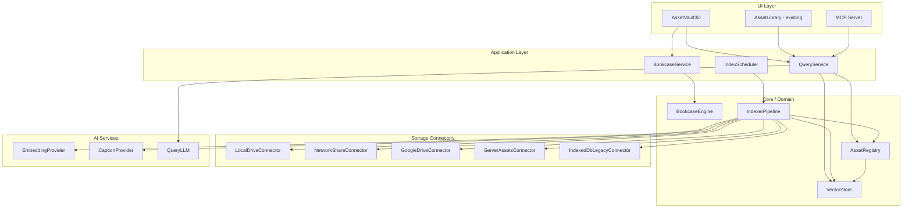

# Unified Asset Vault — Implementation Specification

Date: 2026-07-31  
Status: design / planning  
Audience: engineering, product, AI agent contributors

---

## Executive summary

Image Express already has a strong **creative hierarchy** (Library → Album → Page → Layers) with an innovative **3D stack and federation view**, plus a separate **asset library** spread across IndexedDB, server filesystem, and Google Drive. Search today is keyword-only and store-specific.

This document specifies **Unified Asset Vault (UAV)** — a modular system that:

1. **Indexes assets in place** across local drives, network shares, and cloud providers without moving files.
2. **Unifies discovery** through a single registry with content-hash deduplication and cross-store references.
3. **Adds semantic search** via vector embeddings and LLM-assisted query understanding.
4. **Introduces Bookcases** — flexible, nestable organizational lenses (by type, event, date, project, AI cluster, or custom).
5. **Extends the existing 3D navigation metaphor** from albums/pages into a spatial asset browser that feels like walking through a library room.

The design is deliberately **modular** and **non-breaking**: existing `AssetLibrary`, `localAssetStore`, `assetIndexer`, and multicanvas systems keep working while UAV is adopted incrementally.

---

## Table of contents

1. [Current state & gaps](#1-current-state--gaps)
2. [Design principles](#2-design-principles)
3. [Conceptual model](#3-conceptual-model)
4. [System architecture](#4-system-architecture)
5. [Module layout](#5-module-layout)
6. [Data models](#6-data-models)
7. [Storage connectors](#7-storage-connectors)
8. [Indexing & embedding pipeline](#8-indexing--embedding-pipeline)
9. [Vector search & hybrid ranking](#9-vector-search--hybrid-ranking)
10. [Bookcases — organizational lenses](#10-bookcases--organizational-lenses)
11. [3D Asset Vault UI](#11-3d-asset-vault-ui)
12. [Integration with existing systems](#12-integration-with-existing-systems)
13. [API surface](#13-api-surface)
14. [Electron & desktop considerations](#14-electron--desktop-considerations)
15. [Security & privacy](#15-security--privacy)
16. [Phased rollout](#16-phased-rollout)
17. [Testing strategy](#17-testing-strategy)
18. [Open decisions](#18-open-decisions)

---

## 1. Current state & gaps

### What exists today

| Area | Location | Capability |
|---|---|---|
| Creative hierarchy | `src/lib/multicanvas/projectStore.ts` | Library (Federation) → Album (`Project`) → Page (`ProjectCanvas`) → Layers |
| 3D album navigation | `CanvasStackView.tsx`, `FederationScene.tsx` | Orbiting SVG stack; federation wireframe cubes; shared-layer bridges |
| Local asset store | `src/lib/localAssetStore.ts` | IndexedDB blobs + keyword metadata |
| Asset indexing | `src/lib/assetIndexer.ts` | Dimensions, PNG prompt chunks, optional Ollama caption/tags |
| Server assets | `public/assets/`, `asset-metadata.ts` | Filesystem + owner/visibility JSON index |
| Cloud | `src/lib/googleDrive/*` | Google Drive upload/list; filename search only |
| Storage modes | `src/lib/assetStorageSettings.ts` | `local \| hybrid \| cloud` |
| AI providers | `externalLlm.ts`, Ollama routes, Super Agent | Vision + text LLMs; no embedding pipeline |
| MCP bridge | `scripts/mcp-server.mjs` | HTTP proxy for designs/templates/assets |

Canonical terminology: [`docs/GLOSSARY.md`](./GLOSSARY.md).

### Gaps blocking unified asset management

| Gap | Impact |
|---|---|
| No vector embeddings | Cannot do "find similar" or natural-language asset discovery |
| Fragmented stores | Same file may exist in IndexedDB, server FS, and Drive with no link |
| Indexing is client-only | Server/cloud assets never get AI captions or embeddings |
| Album layers ≠ library assets | Page snapshots inline images as data URLs; no asset registry link |
| No filesystem watcher | External drives and network paths are invisible until manual import |
| Search is substring-only | `listLocalAssets()` matches name/tags/description; no semantic ranking |

### What we reuse

- **`LocalAssetSearchMetadata`** — extend, do not replace.
- **`assetIndexer.ts` pipeline pattern** — basic → AI → persist; add embedding pass.
- **`stack3dMath.ts` camera/projection** — same math for Bookcase 3D rooms.
- **`apiContract.ts`** — Zod validation, request IDs, structured errors for new routes.
- **`externalLlm.ts` + Ollama** — captioning, query expansion, reranking.
- **MCP server** — expose `vault_search`, `vault_browse_bookcase` tools.

---

## 2. Design principles

### Index in place, discover everywhere

Files stay on their original drive, share, or cloud folder. UAV stores **references** (URI + content hash + metadata + embeddings), not copies — unless the user explicitly pins or imports into the working library.

### One registry, many lenses

A single `AssetRecord` can appear in multiple **Bookcases** (type lens, event lens, date lens, project lens) without duplication of blobs or embeddings.

### Non-breaking adoption

- Existing `AssetLibrary.tsx` gains a "Vault" mode and semantic search bar; legacy tabs remain.
- `localAssetStore` records gain an optional `vaultAssetId` back-link.
- Multicanvas albums/pages are unchanged; layers optionally reference vault assets via `assetRefId`.

### Modular boundaries

Follow P1 architecture rules (`docs/P1_ENGINEERING_IMPLEMENTATION.md`):

- Feature modules under `src/features/asset-vault/` do not import component internals.
- Connectors, indexer, vector store, and UI are separate packages with explicit contracts.
- Server routes validate with Zod; no ad-hoc JSON shapes.

### Fast by default, deep when asked

- **Instant**: metadata + keyword + vector ANN (< 100 ms for 100k assets on desktop).
- **Deep**: LLM query understanding and reranking only on explicit search or "smart find" mode.

### Offline-first desktop, hybrid cloud

Electron indexes local/network paths natively. Cloud connectors sync metadata incrementally. Vector index lives locally in desktop mode; optional server-side index for team deployments.

---

## 3. Conceptual model

### Two parallel hierarchies

Image Express operates in two related but distinct domains:

```
CREATIVE WORK (existing)          ASSET DISCOVERY (new)
─────────────────────────         ──────────────────────
Library (Federation)              Vault (all indexed assets)
  └─ Album (Project)                └─ Bookcase (organizational lens)
       └─ Page (Canvas)                  └─ Shelf (group / cluster)
            └─ Layer                         └─ Asset slot (reference)
```

**Album/Page** = editable design surfaces.  
**Bookcase/Shelf** = read-mostly browsing views over the vault index.

They connect when a layer holds an `assetRefId` pointing into the vault, or when a Bookcase is auto-generated from an Album's used assets.

### The Bookcase metaphor

A **Bookcase** is not a folder — it is a **lens**:

| Bookcase type | Example | How assets enter |
|---|---|---|
| **Type** | "Videos", "3D Models", "Generated Images" | Rule: `mimeType starts with video/` or `category = generated` |
| **Event** | "Sarah's Wedding", "Product Launch Q3" | User tag + date range rule |
| **Timeline** | "2026 · July" | Rule: `capturedAt` or `modifiedAt` in range |
| **Project** | "Brand Refresh Album assets" | All `assetRefId`s referenced by Album X |
| **Location** | "Google Drive / Marketing" | Rule: `origin.connector = google-drive` + path prefix |
| **Smart cluster** | "Sunset beach photos" | Vector centroid of seed asset + k-NN |
| **Manual** | "Hero shots I'm shortlisting" | User drag-drop membership |

Bookcases can **nest**: a Timeline bookcase contains month shelves; each shelf holds asset thumbnails arranged like pages in a spread.

### Natural discovery flows

```
User opens Vault 3D room
  → sees Bookcases along walls (Videos | Photos | 2026 Events | …)
  → walks into "2026 Events" bookcase
  → shelves = individual events, left-to-right by date
  → clicks a shelf → pages fan out (contact-sheet spreads of 6–12 assets)
  → selects asset → preview + "Insert into page" / "Find similar" / "Open in Explorer"
```

Search bar: *"golden hour portrait from last summer"* → LLM parses intent → hybrid vector+keyword → results appear as a temporary **Search Bookcase** in the 3D room.

---

## 4. System architecture



### Data flow: ingest

1. Connector enumerates files (walk, watch, or cloud delta sync).
2. For each candidate file: compute **content hash** (SHA-256 of file; partial hash for very large video).
3. Upsert `AssetRecord` in registry (dedupe by hash + origin URI).
4. Indexer pipeline enriches metadata (dimensions, EXIF, PNG prompts, transcript for video).
5. Embedding provider produces vector(s); vector store upserts by `assetId`.
6. Bookcase rules re-evaluate; affected shelves update.

### Data flow: search

1. User query (text, image drop, or "find similar to X").
2. Optional LLM step: expand query, extract filters (type, date, event).
3. Parallel retrieval: keyword (BM25/SQLite FTS) + vector ANN + structured filters.
4. Reciprocal rank fusion (RRF) merges candidates.
5. Optional LLM rerank top-20 for precision.
6. Return ranked `AssetRecord[]` + shelf layout hints for 3D UI.

---

## 5. Module layout

New code lives under `src/features/asset-vault/` with strict import boundaries.

```
src/features/asset-vault/
├── contracts/           # Zod schemas, public types (no internal imports)
│   ├── assetRecord.ts
│   ├── bookcase.ts
│   ├── search.ts
│   └── connector.ts
├── domain/
│   ├── assetRegistry.ts       # CRUD, dedupe, ref counting
│   ├── bookcaseEngine.ts      # Rule evaluation, nesting, membership
│   └── queryFusion.ts         # RRF, filter application
├── connectors/
│   ├── types.ts
│   ├── localDrive.ts          # Electron: fs.watch + walk
│   ├── networkShare.ts        # UNC/SMB paths (Electron)
│   ├── googleDrive.ts         # Extends existing googleDrive/*
│   ├── serverAssets.ts        # Wraps /api/assets/list
│   └── indexedDbLegacy.ts     # Migrates localAssetStore records
├── indexer/
│   ├── pipeline.ts            # Orchestrates passes
│   ├── metadataExtractors.ts  # PNG chunks, EXIF, ffprobe
│   ├── embeddingPass.ts
│   └── captionPass.ts         # Reuses assetIndexer logic
├── vector/
│   ├── vectorStore.ts         # Interface
│   ├── lanceDbAdapter.ts      # Desktop default
│   └── sqliteVecAdapter.ts    # Fallback / CI
├── ai/
│   ├── embeddingProvider.ts   # CLIP, OpenAI, Ollama
│   ├── queryLlm.ts            # Intent parsing
│   └── reranker.ts
├── application/
│   ├── indexScheduler.ts      # Background jobs, priority queue
│   ├── searchService.ts
│   └── bookcaseService.ts
└── __tests__/

src/components/AssetVault/
├── AssetVaultModal.tsx        # Entry point (parallel to AssetLibrary)
├── BookcaseRoom3D.tsx         # 3D room shell
├── BookcaseStackView.tsx      # Extends stack metaphor for shelves
├── ShelfSpreadView.tsx        # Page-like asset spreads
├── VaultSearchBar.tsx
└── hooks/
    ├── useVaultSearch.ts
    └── useBookcaseNavigation.ts

src/app/api/assets/vault/
├── search/route.ts
├── index/route.ts             # Trigger/manual reindex
├── bookcases/route.ts
├── bookcases/[id]/route.ts
├── assets/[id]/route.ts
└── status/route.ts

electron/
└── vault/
    ├── driveWatcher.ts        # chokidar-backed watchers
    └── pathResolver.ts        # Resolve drive letters, UNC roots
```

### Dependency rules

| Module | May import | Must not import |
|---|---|---|
| `contracts/` | Zod only | anything else in app |
| `domain/` | `contracts/` | React, Next routes, components |
| `connectors/` | `contracts/`, `domain/` | UI |
| `application/` | domain, connectors, vector, ai | component internals |
| `AssetVault/*` components | `application/`, hooks | connector internals directly |

---

## 6. Data models

### AssetRecord (canonical vault entity)

```typescript
/** Stable vault ID — survives moves/renames if content hash matches. */
export type VaultAssetId = string; // `vast_${ulid}`

export type AssetOrigin = {
  connector: 'local' | 'network' | 'google-drive' | 'server' | 'indexeddb-legacy';
  /** Canonical URI: file:///D:/Photos/a.jpg, gdrive://fileId, server://assets/images/... */
  uri: string;
  /** Display path for UI */
  displayPath: string;
  /** Root watch entry this file belongs to */
  watchRootId?: string;
};

export interface AssetRecord {
  id: VaultAssetId;
  contentHash: string;           // SHA-256 hex
  name: string;
  mimeType: string;
  type: AssetType;               // existing: images | videos | audio | models
  category?: AssetCategory;      // uploads | generated (when known)
  sizeBytes: number;

  origin: AssetOrigin;
  /** Additional locations with same hash */
  aliases: AssetOrigin[];

  // Temporal
  createdAt: string;             // ISO — file birth or earliest known
  modifiedAt: string;
  capturedAt?: string;           // EXIF DateTimeOriginal

  // Search metadata (extends LocalAssetSearchMetadata)
  description?: string;
  tags?: string[];
  prompt?: string;
  width?: number;
  height?: number;
  durationMs?: number;           // video/audio

  // Index state
  indexedAt?: string;
  embeddingModel?: string;
  embeddingVersion?: number;
  aiIndexed?: boolean;

  // Relations
  usedInAlbums?: string[];       // Project IDs referencing this asset
  sharedLayerIds?: string[];     // Federation links

  // User
  owner?: string;
  isPublic?: boolean;
  userNotes?: string;
}
```

### WatchRoot (connector configuration)

```typescript
export interface WatchRoot {
  id: string;
  label: string;                 // "D: Drive Photos", "\\NAS\Media"
  connector: AssetOrigin['connector'];
  rootUri: string;
  enabled: boolean;
  recursive: boolean;
  includeGlobs: string[];        // **/*.{jpg,png,mp4,glb,wav}
  excludeGlobs: string[];
  lastScanAt?: string;
  lastScanStatus?: 'idle' | 'scanning' | 'error';
  estimatedFileCount?: number;
}
```

### Bookcase & Shelf

```typescript
export type BookcaseKind =
  | 'manual'
  | 'type'
  | 'timeline'
  | 'event'
  | 'project'
  | 'location'
  | 'smart-cluster'
  | 'search-result';

export interface BookcaseRule {
  /** JSON Logic or simple filter DSL — evaluated against AssetRecord */
  filter: BookcaseFilterAst;
  sort?: { field: string; direction: 'asc' | 'desc' };
  groupBy?: 'day' | 'week' | 'month' | 'year' | 'event' | 'folder';
}

export interface Bookcase {
  id: string;
  name: string;
  kind: BookcaseKind;
  icon?: string;
  color?: string;
  parentId?: string;             // nesting
  rule?: BookcaseRule;           // absent for manual bookcases
  manualAssetIds?: VaultAssetId[];
  childBookcaseIds?: string[];
  createdAt: string;
  updatedAt: string;
  /** 3D layout hints */
  layout?: {
    position?: [number, number, number];
    shelfCount?: number;
  };
}

export interface Shelf {
  id: string;
  bookcaseId: string;
  label: string;                 // "July 2026", "Wedding Day 1"
  assetIds: VaultAssetId[];
  sortIndex: number;
}
```

### Layer ↔ Vault bridge (extends multicanvas)

Add optional field to serialized layers in `projectStore.ts`:

```typescript
export type SerializedLayer = {
  // ... existing fields
  /** When set, image src may be resolved from vault instead of inline data URL */
  assetRefId?: VaultAssetId;
  assetRefUri?: string;          // fallback if vault unavailable
};
```

On page save, `inlineImageSources.ts` should prefer vault refs for library-sourced images to reduce snapshot bloat.

---

## 7. Storage connectors

Each connector implements a shared interface:

```typescript
export interface StorageConnector {
  id: string;
  type: AssetOrigin['connector'];
  /** Full or incremental enumeration */
  scan(watchRoot: WatchRoot, signal: AbortSignal): AsyncIterable<ScannedFile>;
  /** Resolve readable stream for indexing (thumbnail, embedding) */
  openReadStream(origin: AssetOrigin): Promise<ReadableStream<Uint8Array>>;
  /** Watch for changes (optional — local/network in Electron) */
  watch?(watchRoot: WatchRoot, onChange: ChangeEvent): () => void;
}
```

### Connector matrix

| Connector | Platform | Scan strategy | Watch |
|---|---|---|---|
| **LocalDrive** | Electron, optionally browser (File System Access API) | Recursive walk with globs | `chokidar` |
| **NetworkShare** | Electron | UNC path walk; slower, cached | Periodic poll + optional notify |
| **GoogleDrive** | All | Drive API changes feed + folder recurse | Push via changes API |
| **ServerAssets** | Web + desktop | `/api/assets/list` pagination | Poll asset-index.json mtime |
| **IndexedDbLegacy** | Browser | One-time import of `localAssetStore` | N/A (hooks into existing events) |

### Path configuration UI

Extend **Settings → Storage** (`StorageTab.tsx`):

- Add "Vault watch roots" section: list of drives/folders/cloud folders.
- Per root: enable/disable, include/exclude patterns, scan now, status.
- Desktop: "Add drive/folder" native picker.
- Web: limited to server assets + Google Drive + manually granted folders.

---

## 8. Indexing & embedding pipeline

Extends the existing two-pass model in `assetIndexer.ts` to four passes:

| Pass | Always? | Output |
|---|---|---|
| **1. Basic** | Yes | hash, size, mime, dimensions, EXIF date, PNG prompt chunks |
| **2. Media** | If video/audio | duration, keyframe thumbnail, optional transcript stub |
| **3. AI caption** | Opt-in (settings) | description, tags (Ollama / OpenAI / Gemini) |
| **4. Embedding** | Opt-in (default on desktop) | 512-dim CLIP vector (+ optional text embedding of caption) |

### Embedding provider strategy

| Provider | Where | Model | Notes |
|---|---|---|---|
| **Transformers.js (CLIP)** | Browser / Electron renderer | `Xenova/clip-vit-base-patch32` | Reuses `@huggingface/transformers`; consistent with depth pipeline |
| **Ollama** | Local server | `mxbai-embed-large` or vision model | Good for desktop offline |
| **OpenAI** | Server API | `text-embedding-3-small` | Text-only fallback for captions |
| **Google** | Server API | `text-embedding-004` | Alternative cloud |

**Recommendation:** CLIP in-process for images; store one **primary visual embedding** per asset. Caption text indexed in SQLite FTS for keyword path. Optionally store a **text embedding** of `description + tags + prompt` for cross-modal search.

### Index scheduler

```typescript
// Priority queue — user-visible assets first
type IndexJobPriority = 'interactive' | 'background' | 'backfill';

interface IndexJob {
  assetId: VaultAssetId;
  passes: Array<'basic' | 'media' | 'caption' | 'embedding'>;
  priority: IndexJobPriority;
}
```

- **Interactive**: user just imported or searched a folder — index first 50 immediately.
- **Background**: watcher-detected changes during idle time.
- **Backfill**: initial scan of large drives — chunked, pausable, resumable.

Persist queue state in `data/vault/index-queue.json` (server) or Electron userData (desktop).

### Deduplication

Same `contentHash` → one `AssetRecord`, multiple `aliases`. Embedding computed once. Bookcase membership applies to the canonical record.

---

## 9. Vector search & hybrid ranking

### Vector store selection

| Option | Pros | Cons | Verdict |
|---|---|---|---|
| **LanceDB** | Embedded, columnar, fast ANN, Node native | New dependency | **Primary for desktop** |
| **sqlite-vec** | Single file, FTS5 + vectors together | Younger ecosystem | **Fallback / tests** |
| **Qdrant local** | Mature ANN | Separate process | Optional team server mode |

Store under `{dataDir}/vault/vectors/` — alongside existing JSON stores pattern in `appPaths.ts`.

### Hybrid query algorithm

```typescript
async function searchVault(query: SearchQuery): Promise<SearchResult[]> {
  const filters = query.filters ?? parseFiltersFromLlm(query.text); // optional

  const [keywordHits, vectorHits] = await Promise.all([
    ftsSearch(query.text, filters),
    query.embedding
      ? vectorAnn(query.embedding, filters, { limit: 100 })
      : vectorAnn(await embedText(query.text), filters, { limit: 100 }),
  ]);

  const fused = reciprocalRankFusion(keywordHits, vectorHits, { k: 60 });
  const top = fused.slice(0, 20);

  if (query.mode === 'smart') {
    return llmRerank(query.text, top); // uses externalLlm or Ollama
  }
  return top;
}
```

### "Find similar"

Use asset's stored CLIP embedding → k-NN → present as a **Smart Cluster Bookcase** (temporary or saveable).

### Image-as-query

Drop an image on search bar → CLIP embed image → vector ANN → no LLM required for basic similarity.

---

## 10. Bookcases — organizational lenses

### Default bookcases (auto-created on first vault setup)

1. **All Assets** — manual root, everything
2. **Photos** — `type = images`
3. **Videos** — `type = videos`
4. **3D Models** — `type = models`
5. **Generated** — `category = generated`
6. **Timeline** — groupBy month on `capturedAt ?? modifiedAt`
7. **Google Drive** — `origin.connector = google-drive`
8. **This Project** — dynamic per active Album

### Nesting example

```
Timeline (Bookcase)
├── 2026 (child Bookcase)
│   ├── January (Shelf)
│   ├── February (Shelf)
│   └── July (Shelf) ← current month highlighted
└── 2025 (child Bookcase)
```

### Smart cluster bookcase

User selects seed asset → system computes k-NN (k=40) → creates bookcase with rule `{ kind: 'smart-cluster', seedId, threshold }`. Re-evaluates when index updates.

### Search result bookcase

Ephemeral bookcase; discarded on close unless user pins it.

### Bookcase persistence

`data/vault/bookcases.json` (server) or IndexedDB store `vault-bookcases` (client). Rules are data, not code — safe to sync.

---

## 11. 3D Asset Vault UI

### Design intent

Reuse the **spatial memory** users already learn in `CanvasStackView`:

| Album 3D (existing) | Vault 3D (new) |
|---|---|
| Page planes in a stack | Asset spreads on a shelf |
| Album federation cubes | Bookcases in a room |
| Shared-layer bridges | Similarity arcs between related assets |
| Orbit camera | Same `stack3dMath.ts` camera |

### View levels

```
Level 0: VAULT ROOM
  - Bookcases positioned along walls / in a ring (like FederationScene albums)
  - Floor shows recent / favorites strip
  - Search bar floats top-center

Level 1: BOOKCASE INTERIOR
  - Vertical shelves (like page stack along Y axis)
  - Shelf labels on spine
  - Click shelf → Level 2

Level 2: SHELF SPREAD
  - Horizontal "pages" — each page = contact sheet grid (6–12 thumbs)
  - Paginate large shelves
  - Asset click → preview drawer

Level 3: ASSET FOCUS (optional)
  - Large preview, metadata, similarity strip, actions
```

### Component reuse map

| Existing | New usage |
|---|---|
| `stack3dMath.ts` | Camera, projection, depth sorting |
| `CanvasStackView.tsx` patterns | Drag orbit, plane layout, x-ray inactive |
| `FederationScene.tsx` | Bookcase ring layout, connection curves for similar assets |
| `StackEffects.tsx` | Subtle particles on shelf/bookcase create |
| `Asset3DPreview.tsx` | GLB preview in asset focus |
| `ThreeDLayerEditor.tsx` | Unchanged; opens from vault for 3D models |

### Navigation UX

- **Mouse**: drag to orbit, scroll zoom, click to enter bookcase/shelf.
- **Keyboard**: arrow keys move between shelves; `/` focuses search.
- **Touch**: pinch zoom, swipe between spreads (future mobile companion synergy).

### Flexibility controls

Toolbar in vault room:

- **+ New Bookcase** → wizard: type / event / manual / smart cluster
- **Edit lens** → adjust rules without moving files
- **Pin to sidebar** → bookcase appears in AssetLibrary filter chips
- **Sync with Album** → create project-linked bookcase from active album

---

## 12. Integration with existing systems

### AssetLibrary.tsx

Phase 1 integration (low risk):

- Add semantic search toggle using `searchService`.
- Show `vaultAssetId` badge on assets linked to vault.
- "Reveal in vault" context menu opens `AssetVaultModal` focused on asset.

Phase 2:

- Unified listing merges local/server/drive via registry instead of three separate fetches.

### localAssetStore.ts

- On save: optionally mirror to vault via `IndexedDbLegacyConnector`.
- Add optional `vaultAssetId` field to `LocalAssetRecord`.
- Deprecate duplicate metadata fields over time — vault becomes source of truth for search metadata.

### assetIndexer.ts

- Refactor caption/dimension logic into `features/asset-vault/indexer/metadataExtractors.ts`.
- Existing file becomes thin wrapper calling shared pipeline for backward compatibility.

### multicanvas / projectStore

- Add `assetRefId` to layers when inserting from vault.
- `inlineImageSources.ts`: if `assetRefId` present, store ref not blob when possible.
- Federation links: enrich `ProjectLink` with `vaultAssetIds[]` when shared layers use vault assets.

### Super Agent & MCP

Super Agent gains tools:

- `vault_search(query, filters?)`
- `vault_insert_asset(assetId, pageId?)`
- `vault_create_bookcase(name, rule?)`

MCP server (`scripts/mcp-server.mjs`) registers matching HTTP-backed tools for external agents.

### Google Drive

Extend `src/lib/googleDrive/*`:

- Folder watch roots map to Drive folder IDs.
- Metadata-only sync (no download) unless thumbnail/embedding needed.
- Reuse OAuth from existing storage settings.

---

## 13. API surface

All routes under `/api/assets/vault/*`, validated with Zod, auth via `resolveRequestUser()`.

| Method | Route | Purpose |
|---|---|---|
| GET | `/api/assets/vault/status` | Index stats, queue depth, last scan |
| POST | `/api/assets/vault/search` | Hybrid search body: `{ query, mode, filters, imageBase64? }` |
| GET | `/api/assets/vault/assets/[id]` | Asset record + signed/preview URL |
| POST | `/api/assets/vault/index` | Trigger scan: `{ watchRootId?, full?: boolean }` |
| GET/POST | `/api/assets/vault/bookcases` | List / create bookcases |
| PATCH/DELETE | `/api/assets/vault/bookcases/[id]` | Update / delete |
| GET | `/api/assets/vault/bookcases/[id]/shelves` | Materialized shelves |
| POST | `/api/assets/vault/watch-roots` | Register watch root |
| GET | `/api/assets/vault/similar/[id]` | k-NN similar assets |

### Example search request

```json
{
  "query": "sunset beach photos from vacation last year",
  "mode": "smart",
  "filters": {
    "type": "images",
    "dateRange": { "from": "2025-06-01", "to": "2025-09-30" }
  },
  "limit": 40
}
```

### Example search response

```json
{
  "success": true,
  "results": [
    {
      "asset": { "id": "vast_01...", "name": "IMG_2847.jpg", "origin": { "displayPath": "D:/Photos/2025/IMG_2847.jpg" } },
      "score": 0.92,
      "matchReasons": ["semantic: sunset beach", "keyword: vacation", "date: 2025-07-14"]
    }
  ],
  "interpretedQuery": {
    "intent": "photo search",
    "expandedTerms": ["sunset", "beach", "ocean", "golden hour"]
  },
  "ephemeralBookcaseId": "bc_search_01..."
}
```

---

## 14. Electron & desktop considerations

Image Express already ships Electron (`electron/`). UAV features are **desktop-first**:

| Capability | Web app | Electron |
|---|---|---|
| Index local drives | ❌ | ✅ |
| Index network shares | ❌ | ✅ |
| File system watch | ❌ | ✅ chokidar |
| LanceDB embedded | ⚠️ WASM fallback | ✅ native |
| Background indexing | Limited | ✅ main process worker |

### Process model

```
Electron Main Process
  ├── vault driveWatcher (chokidar)
  ├── vault indexWorker (embedding via worker thread)
  └── IPC: vault:* channels

Renderer (Next.js)
  ├── AssetVault3D UI
  └── searchService → local IPC or HTTP localhost
```

Use existing Electron patterns from desktop docs (`docs/DESKTOP.md`).

---

## 15. Security & privacy

- **Credentials**: Cloud connector tokens stay in existing encrypted vault; never in vector index.
- **Embeddings**: Derived data — user setting to disable cloud caption/embedding for sensitive roots.
- **Path exposure**: `displayPath` shown only to owning user; public server assets follow existing visibility rules.
- **Network shares**: Read-only indexing by default; no write without explicit user action.
- **LLM calls**: Query text may leave device in smart mode — disclose in settings (same pattern as existing AI features).
- **Excluded paths**: Default exclude `.git`, `node_modules`, system folders; user-configurable.

---

## 16. Phased rollout

### Phase 0 — Foundation (2–3 weeks)

- [ ] `contracts/` types + Zod schemas
- [ ] `AssetRegistry` with SQLite metadata store (`data/vault/registry.db`)
- [ ] `IndexedDbLegacyConnector` + `ServerAssetsConnector`
- [ ] Basic FTS keyword search API
- [ ] Vault status UI in Settings

**Exit criteria:** Legacy assets searchable in one list; no 3D yet.

### Phase 1 — Embeddings & hybrid search (3–4 weeks)

- [ ] CLIP embedding pass (Transformers.js)
- [ ] LanceDB / sqlite-vec integration
- [ ] Hybrid search API + AssetLibrary search bar upgrade
- [ ] Index scheduler with backfill

**Exit criteria:** "Find similar" works for images; semantic search beats keyword-only in manual QA.

### Phase 2 — Bookcases & 3D room (3–4 weeks)

- [ ] Bookcase engine + default lenses (type, timeline)
- [ ] `AssetVaultModal` with room + bookcase interior views
- [ ] Reuse `stack3dMath` camera
- [ ] Manual + smart cluster bookcases

**Exit criteria:** User can browse photos by month in 3D and create a custom bookcase.

### Phase 3 — Multi-drive & cloud (3–4 weeks)

- [ ] Electron local + network connectors
- [ ] Google Drive metadata sync
- [ ] Watch roots UI in Storage settings
- [ ] Deduplication across origins

**Exit criteria:** Index 2+ local roots + Drive; dedupe verified.

### Phase 4 — Deep AI & agent integration (2–3 weeks)

- [ ] LLM query understanding + rerank
- [ ] Super Agent + MCP vault tools
- [ ] Layer `assetRefId` bridge + slimmer page snapshots
- [ ] Video keyframe embedding (stretch)

**Exit criteria:** Super Agent can search vault and insert asset; MCP tools documented in `docs/MCP.md`.

---

## 17. Testing strategy

| Layer | Approach |
|---|---|
| `domain/` | Unit tests: dedupe, bookcase rules, RRF fusion |
| `indexer/` | Fixture PNGs with embedded prompts; mock embedding provider |
| `vector/` | In-memory sqlite-vec for CI; recall@k benchmarks optional |
| `connectors/` | Temp directories; mock Drive API |
| API routes | Route tests with schema validation (pattern from existing route tests) |
| UI | Playwright: open vault, navigate bookcase, search, insert to canvas |
| Electron | Smoke test: watch temp folder, detect new file |

Performance targets (desktop, 50k images):

- Registry lookup by ID: < 5 ms
- Hybrid search p95: < 200 ms
- Initial index throughput: > 20 images/sec (basic pass only)

---

## 18. Open decisions

| Decision | Options | Recommendation |
|---|---|---|
| Vector DB | LanceDB vs sqlite-vec vs Qdrant | LanceDB desktop; sqlite-vec CI fallback |
| Embedding model | CLIP base vs large | Start CLIP ViT-B/32; upgrade path documented |
| Bookcase rule DSL | JSON Logic vs custom | Custom minimal filter AST — easier to validate |
| Registry DB | SQLite vs JSON files | SQLite for FTS5 + metadata; matches scale needs |
| Video embedding | Keyframe CLIP vs dedicated video model | Phase 4 keyframe approach first |
| Team sync | Central server index vs per-device | Per-device default; server optional later |

---

## Appendix A — Mapping to glossary terms

| Vault term | Glossary / code term | Relationship |
|---|---|---|
| Vault | (new) | Superset index over all asset sources |
| Bookcase | (new) | Organizational lens — not Album |
| Shelf | (new) | Grouping within Bookcase |
| Album | `Project` | Creative multi-page work — unchanged |
| Page | `ProjectCanvas` | Editable canvas — unchanged |
| Library | Federation / `ProjectsState` | All albums — unchanged |
| Asset slot | `AssetRecord` reference | Points to file, not a Layer |

When discussing with users: **"Bookcase"** is vault-only vocabulary; **"Album"** remains creative work.

---

## Appendix B — Related files (integration index)

| File | Role in UAV |
|---|---|
| `src/lib/localAssetStore.ts` | Legacy store → connector |
| `src/lib/assetIndexer.ts` | Caption pass donor |
| `src/lib/assetStorageSettings.ts` | Extended with watch roots |
| `src/lib/multicanvas/stack3dMath.ts` | 3D camera math |
| `src/components/Editor/CanvasStackView.tsx` | UX reference |
| `src/components/Editor/FederationScene.tsx` | Room layout reference |
| `src/components/AssetLibrary.tsx` | Search + entry integration |
| `src/lib/server/appPaths.ts` | `vault/` data directory |
| `src/lib/server/externalLlm.ts` | Query LLM + reranker |
| `scripts/mcp-server.mjs` | Agent tools |

---

## Appendix C — Innovation summary

What makes this approach distinctive:

1. **Dual hierarchy** — creative Album/Page work stays separate from asset Bookcases, linked by refs not duplication.
2. **Lens-based organization** — same files appear in type, event, and timeline bookcases simultaneously without copying.
3. **Spatial continuity** — vault 3D reuses the album stack metaphor users already know; federation room becomes a library room.
4. **Hybrid intelligence** — vectors for speed, LLMs for understanding, keyword for precision — each where it excels.
5. **Index-in-place** — respects terabytes on NAS and multi-drive workflows common in creative studios.
6. **Agent-ready** — vault is a first-class MCP/Super Agent surface, not a siloed UI feature.

This specification is intended to be implementation-ready: start with Phase 0 contracts and registry, validate search quality in Phase 1, then deliver the innovative 3D bookcase experience in Phase 2 without blocking on full multi-drive support.
